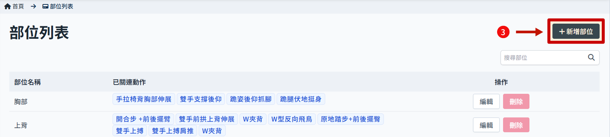
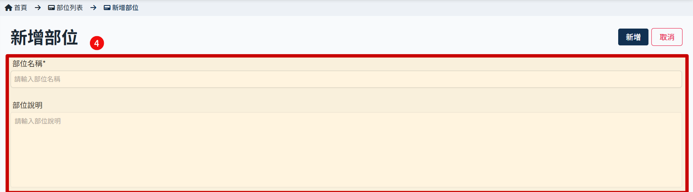

# 新增部位

> 部位用於動作設定內使用，主要影響部分課程有部位不可重複的限制；另外預留之後可能會有展示部位說明／示意圖的需求。

1. 點擊側邊欄 部位管理 進入 部位列表
   
2. 部位列表顯示部位名稱及已關聯的動作
   
3. 右上角點擊 新增部位
   
4. 填寫 部位名稱/說明。注意名稱不可與已有的部位重複。
   
5. 可新增多語系設定；部位說明可透過欄位上方之語系切換按鈕（ZH/CH/EN，預設語系必填）進行填寫各語系內容。
6. 點擊 新增
   
7. 新增成功
