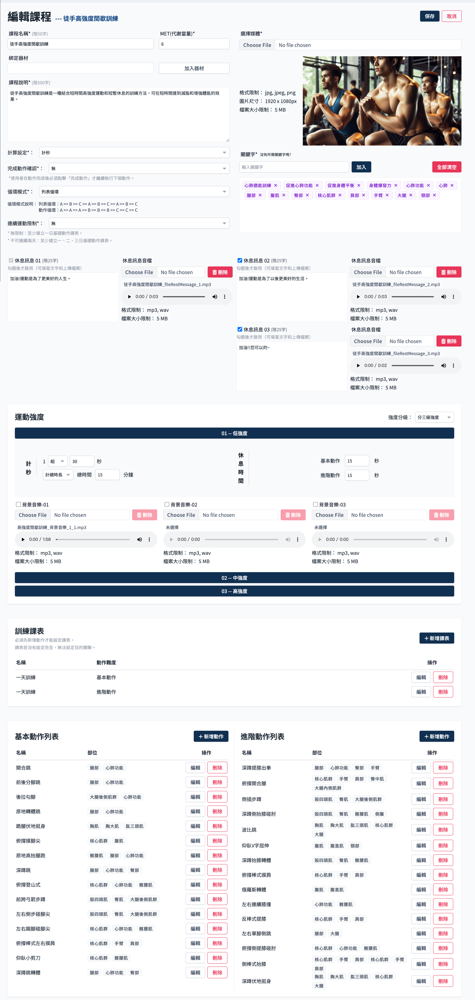
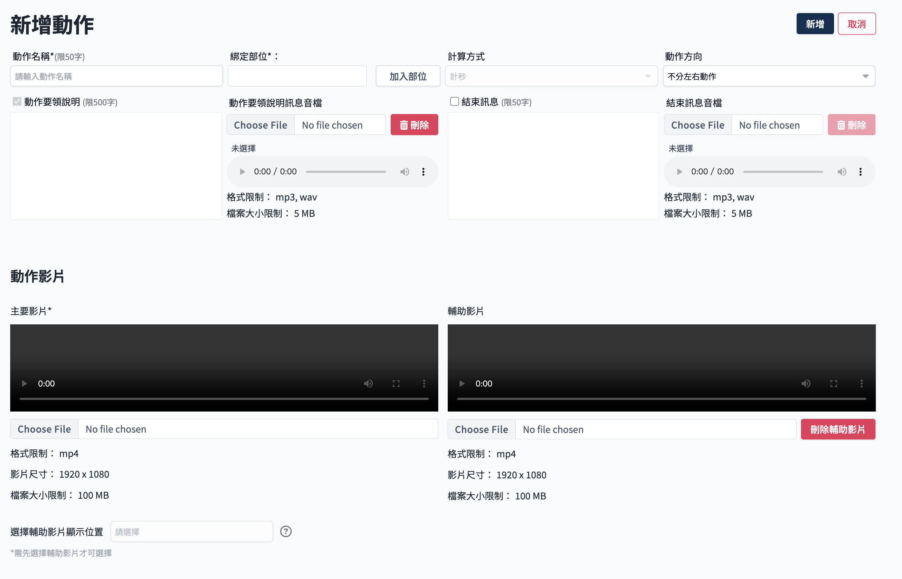
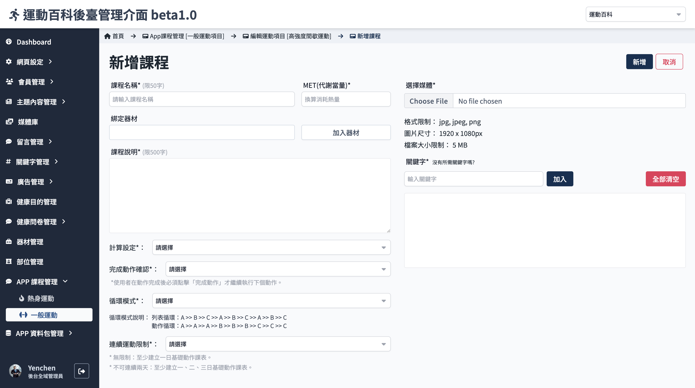
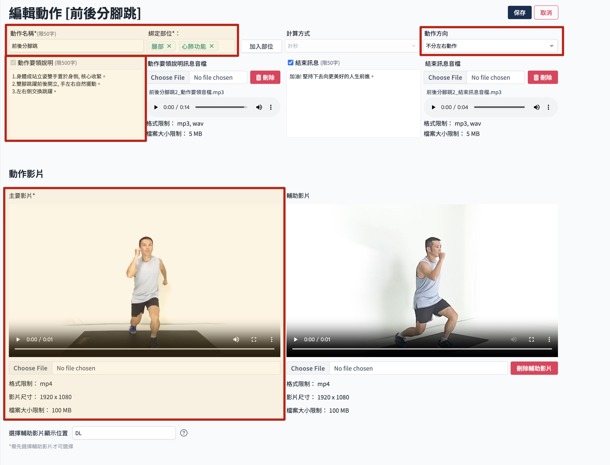
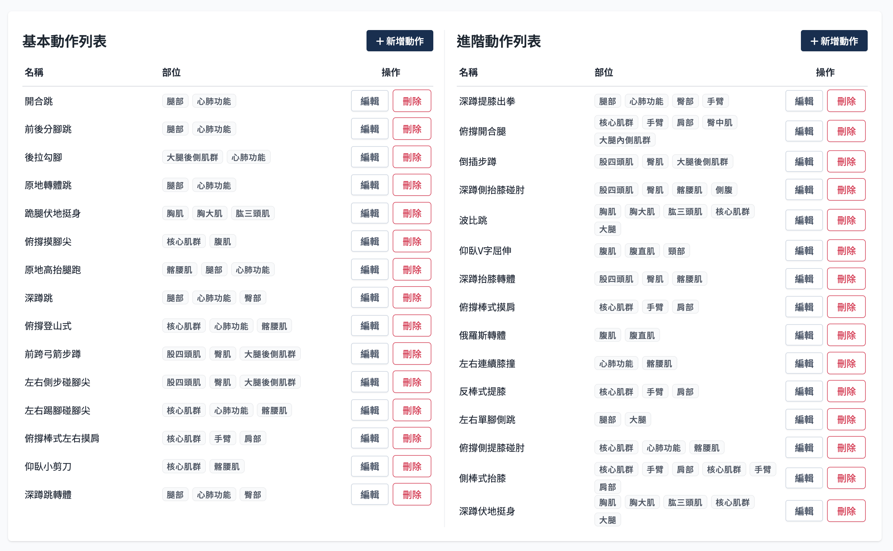

# 動作管理

- 動作是構成運動課程的基本單位，分為基本動作及進階動作列表。
- 課程資訊頁面保存時並沒有驗證動作數量，但是在設定課表頁面內有驗證，沒有動作會無法新增課表。

> 參考[APP 課程資料結構說明](./course-intro.md)了解課程結構。

## 操作流程

運動課程內下拉到動作列表處，操作動作相關流程。

### 新增動作

1. 點選 新增動作
   

2. 進入動作資訊頁面，填寫必要的動作資訊。
   
   欄位規範如下：
    - 動作名稱：同個課程下動作名稱不可重復。
    - 多語系設定：可新增簡體中文與英文運動項目名稱。
    - 綁定部位：必填，設定動作的部位，部位列表來自部位管理，參考 [新增部位](../body/add-body-part.md)。
    - 動作方向：設定是否分左右動作，若選擇區分左右動作，須分別上傳左右動作影片。
    - 動作要領說明：僅限制文字必填，音檔不限制；可透過欄位上方之語系切換按鈕（ZH/CH/EN，預設語系必填）進行填寫各語系說明內容。
    - 動作影片
        - 主要影片：必填。
        - 輔助影片：選填。
        - 輔助影片顯示位置：有設定輔助影片時才需要選擇。

3. 點選 新增，完成動作新增。
   

### 編輯動作

基本同新增動作。

1. 點選 編輯
   

2. 進入動作編輯頁面，欄位限制同上新增動作。
   

3. 完成編輯後點選 保存，完成動作編輯。
   

### 刪除動作

1. 點選要 刪除 的動作
   

2. 點選 確認刪除。
   :::danger
   刪除後無法還原，請謹慎操作。
   :::
   
