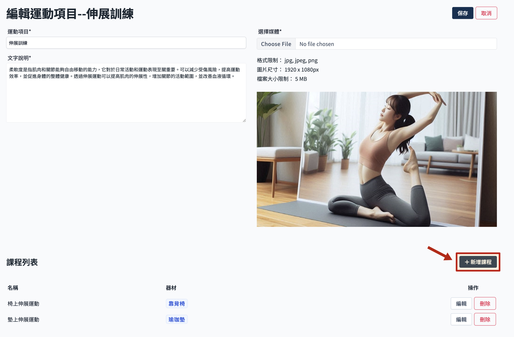
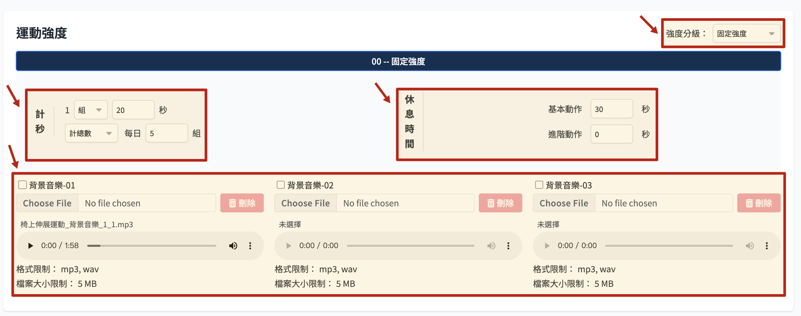
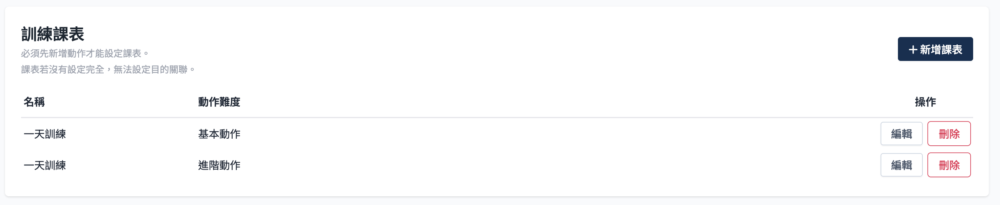
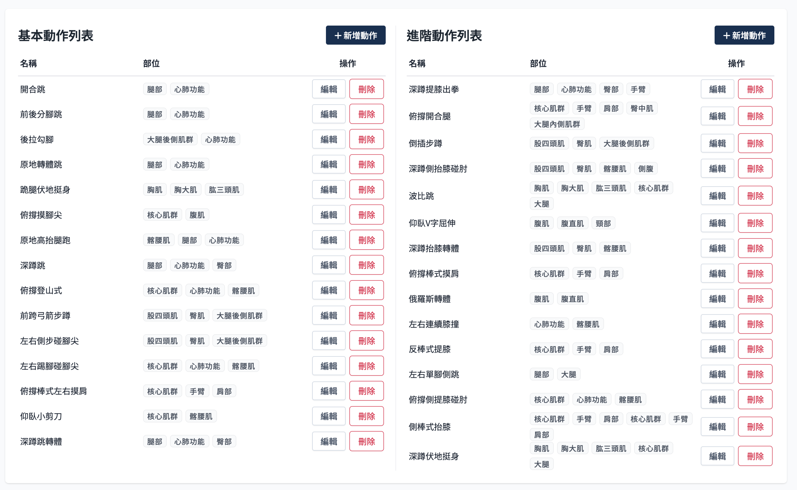

# 運動課程

## 操作流程

課程這邊因為要填寫的內容很多，所以在新建課程的時候會分兩階段建立資料，第一階段先填寫課程的基本資訊，建立課程後，再點擊編輯課程，才可新增動作以及課表。

### 新增運動課程

1. 從運動項目內，點擊新增課程，開啟新增課程頁面
   

2. 填寫基本資訊
   
   以下是課程資訊各欄位的限制規範：
    - 課程名稱：不可重複
    - MET 代謝當量
        - 換算熱量使用。
    - 綁定器材
        - 必須在器材管理先建立器材，這裡才能調整。參考 [新增器材](../equipment/add-equipment.md)。
        - 是否有設定器材會影響使用者篩選條件。
        - 最多可設定三項器材。
    - 課程說明
        - 限 500字內。
    - 圖檔
    - 關鍵字
        - 必填，看後續是否會以關鍵字作為搜尋或篩選判斷。
    - 計算設定
        - 可選擇計次或者計秒，主要影響運動強度設定的單位。
    - 循環模式設定
        - 組數重複：A >> A >> A >>　 B >> B >> B >>　 C >> C >> C
        - 回合重複：A >> B >> C >> 　A >> B >> C >>　 A >> B >> C
    - 完成動作確認
        - 每個動作需要點擊確認後才執行下一個動作。
    - 連續運動限制
        - 無限制：至少須建立一日課表。
        - 不可連續兩天：至少須建立一、二、三日的基本動作課表。

3. 保存資訊

### 編輯運動課程

#### 休息訊息

- 至少需要設定 休息訊息01，最多可設定三個。若有多個休息訊息，會全部提供給前端使用。
- 文字欄位為必填，音檔不限制。

#### 設定運動強度

- 分為固定強度、三級、五級，影響下方強度設定欄位。
  

- 間歇休息時間
  動作與動作之間的休息時間，預設 0 秒。

- 強度設定
    - 可設定計次與計秒情況下每個動作的運動組數及次數。
    - 每個強度至少都需要設定一個背景音樂。

#### 訓練課表

- 有設定連續限制的課程，須設定一二三日的基本動作課表才能通過資料驗證。
- 沒有連續限制的課程，僅須設定一日基本動作課表。

#### 動作列表

- 詳見[動作操作說明](./action-manage.md)
- 分為基本動作及進階動作列表。
- 課程資訊頁面保存時並沒有驗證動作數量，但是在設定課表頁面內有驗證，沒有動作會無法新增課表。

### 刪除課程
