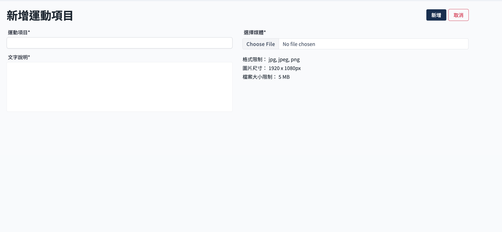
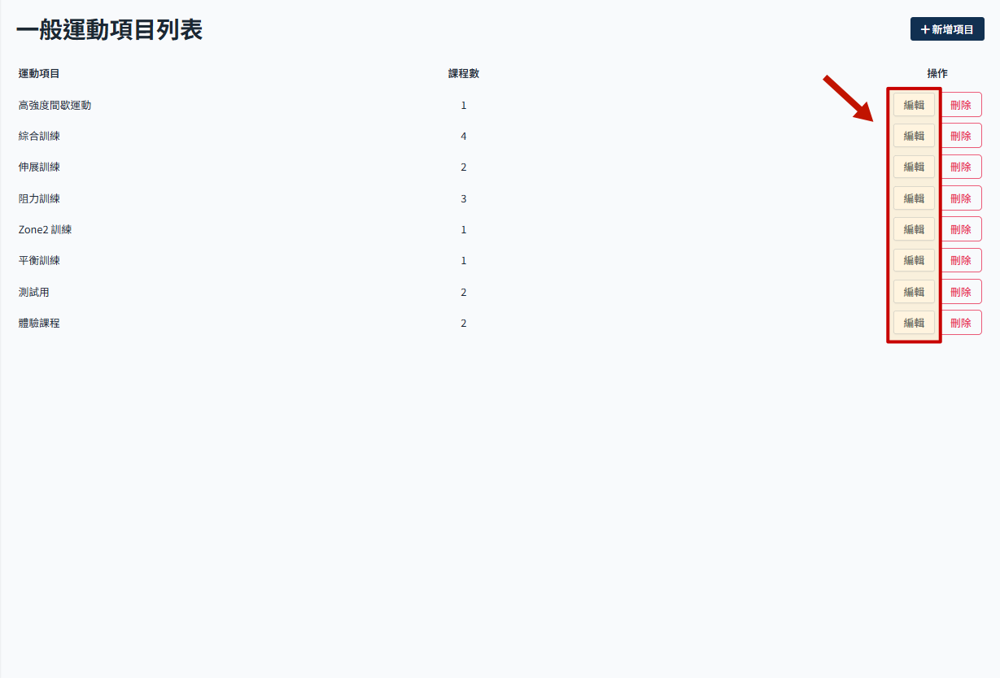
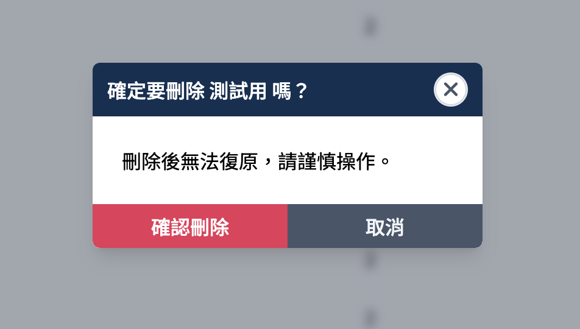

# 運動項目管理

> 關於課程結構參考 [APP 課程資料結構說明](./course-intro.md)

## 操作流程

### 新增運動項目

增加新的運動項目，運動項目之下可以新增運動課程。

1. 從 sideMenu 點擊 APP 課程管理，展開選單後，點擊 一般運動 進入一般運動項目列表
   

2. 點選 新增項目
   

3. 填寫運動項目資訊
   

4. 可新增多語系設定；文字說明可透過欄位上方之語系切換按鈕（ZH/CH/EN，預設語系必填）進行填寫各語系內容。
5. 點選 新增 即保存
   

### 編輯運動項目

1. 點選 編輯 目標運動項目
   

2. 進入運動項目頁面，可以修改項目資訊，下方可檢視該項目內的運動課程列表。課程管理參考 [運動課程管理](./course-manage.md)。
   

### 刪除運動項目

1. 點選 刪除 目標運動項目
   

2. 二次確認彈窗，點選 確認刪除
   :::danger
   刪除後無法還原，請謹慎操作。
   :::
   
