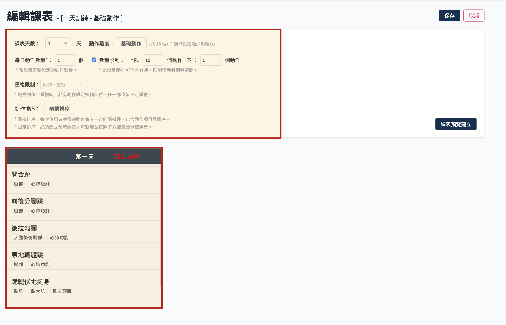
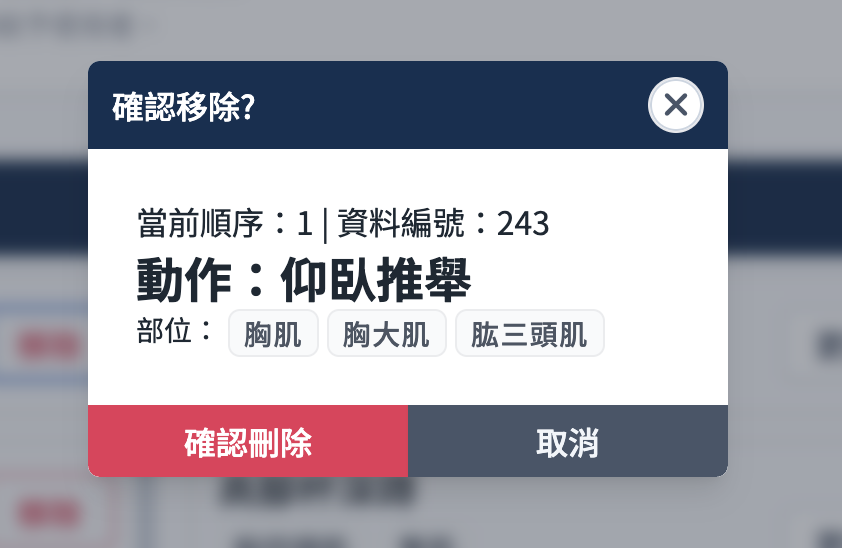
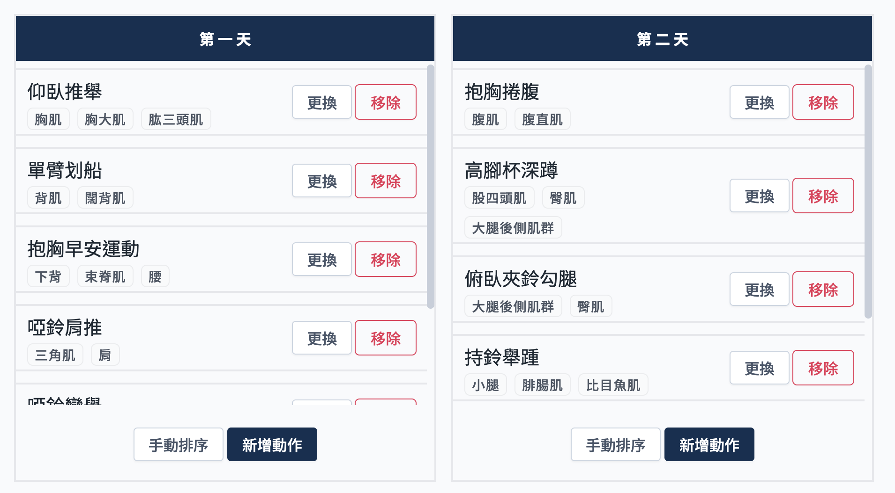
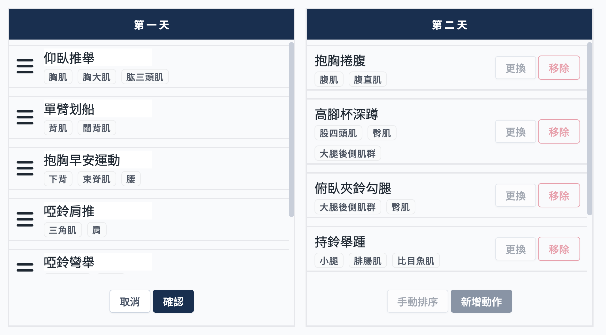
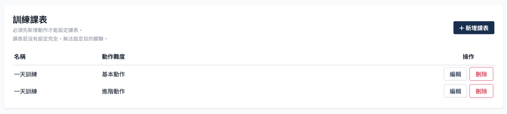

# 運動課表

> 參考[APP 課程資料結構說明](./course-intro.md)了解課程結構。

## 欄位說明

- 課表天數：可選擇一到三日，不可重複建立，系統會自動判斷已建立過得不可選擇。
- 動作難度
    - 可選擇基礎動作或進階動作。
    - 若所選擇的動作清單內動作數量為零，保存時會回報無法新增/儲存課表。

- 每日動作數量
    - 影響下方課程預覽建立產生的動作數量
    - 數量限制：此設定僅在 APP 內作用，限制使用者新增刪除動作的調整空間。
- 重複限制
  兩天以上的課表才可選擇。
    - 動作不重複
    - 部位不重複：選擇部位不重複時，若有動作設定多個部位，任一部位皆不可重複。

- 動作排序
    - 隨機排序:按照上方欄位的限制設定，系統自動排列動作清單，有一定隨機性。
    - 固定排序:需點擊旁邊課表預覽建立，會按照這裡所顯示的動作清單提供給使用者。

## 操作流程

從課程資訊內，訓練課表區塊，可選擇 新增 或者編輯已經設定的課表。每個課程至少需要有一天的基礎動作課表，若是有連續限制的課程，則是需要建立一二三日的基礎動作課表。

### 設定隨機排序課表

1. 選擇天數
2. 選擇動作難度
3. 填寫動作數量
4. 設定重複限制，在生成課表的時候會按照限制排除
5. 動作排序選擇 隨機排序
6. 點選課表預覽建立，這裡可以看到課表大概會是怎麼樣，但不會保存內容，使用者每次進入課程都會依照設定條件由系統產生課表，有一定隨機性。
   

### 設定固定排序課表

主要是針對部分課程需要規範動作執行順序，才需要自訂調整每天的動作清單。

1. 選擇天數
2. 選擇動作難度
3. 填寫動作數量 -> 固定排序基本上都需要設定動作，所以這邊隨便寫數字都可
4. 設定重複限制，在生成課表的時候會按照限制排除
5. 動作排序選擇 固定排序
6. 點選課表預覽建立
7. 這時下方會按設定先行產生一個課表，此時可以自行設定動作順序
   
    - 更換：點選後可以從上面設定的動作列表內選擇其他動作替換
    - 移除：移除此動作，會出現確認彈窗。
      
    - 手動排序：可以調整動作順序
        1. 點選手動排序
           
        2. 可拖曳動作調整順序
           
        3. 點選 確認，保存順序
           
    - 新增動作：點選後會有彈窗顯示動作列表，可選擇要加入的動作

## 刪除課表

1. 點選要 刪除 的課表
   

2. 點選 確認刪除。
   :::danger
   刪除後無法還原，請謹慎操作。
   :::
   
