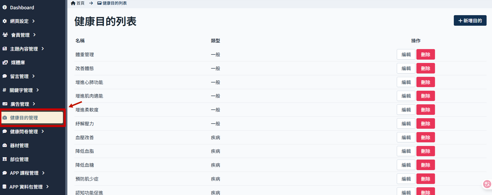
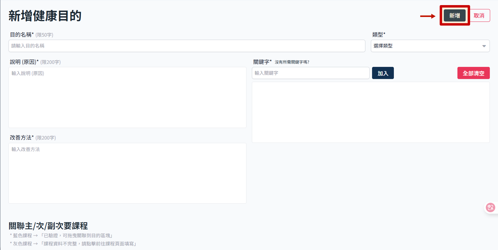

# 新增健康目的

> 先新增課程後再來操作健康目的，因為如果沒有綁定主要課程，健康目的無法正確送出。

## 操作步驟

1. 從　sidemenu　進入健康目的管理
   
2. 此時畫面會顯示健康目的列表，點選新增目的
   

3. 新增健康目的頁面，填寫目的說明等基本資訊
   - 多語系設定：可新增簡體中文或英文的關鍵字名稱。
   - 點選說明原因以及改善方法欄位上方的語系切換按鈕（ZH/CH/EN，預設語系必填），可填寫對應語系的說明內容。
   

4. 設定關聯課程，使用拖曳方式把課程放到對應的欄位即可
   

    > 這邊涉及課程本身資料完整性，若不完整就無法設定，詳細狀態規範參考 >> [設定健康目的對應課程](set-recommend-course.md)

5. 右上角點選「新增」即完成步驟
   
