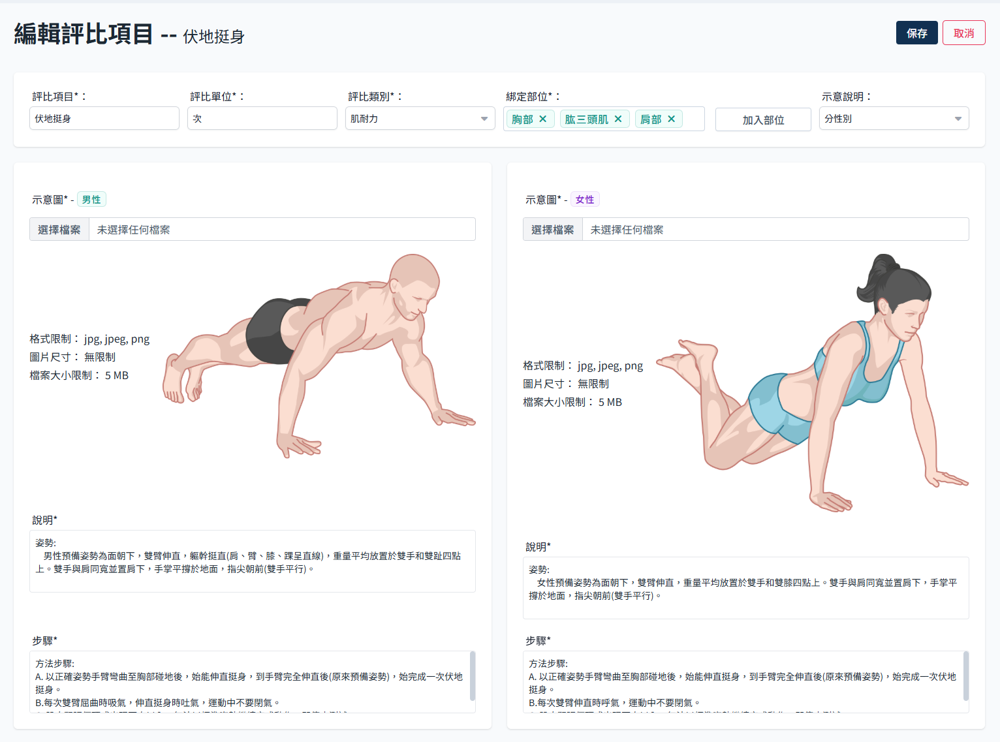
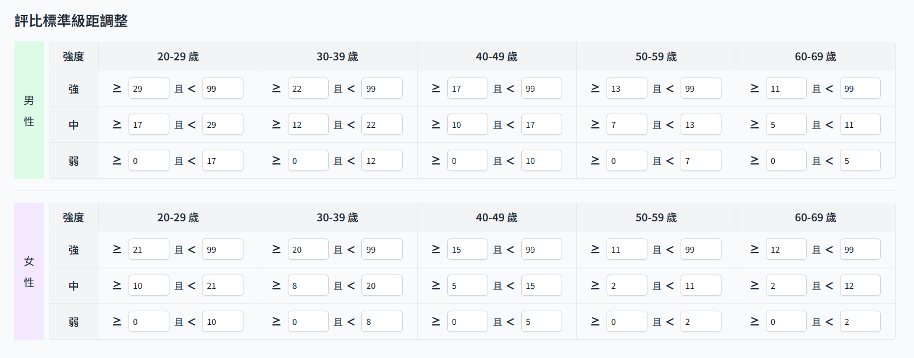

# 數據評比項目

數據評比內依照需求可建立不同類別的評比項目，每個評比項目需要建立對應的數據表格。

## 操作流程

### 新增評比項目

:::warning 必填欄位
此頁面若有任何一個空缺欄位即無法送出。
:::

- 進入評比版本後，點選新增
  

- 新增評比項目頁面分為2個區塊
  
    - 基本資料與示意圖
    - 對應級距設定：使用者填寫的數值對應的強度，這邊務必注意填寫數據的正確性，如有填錯會導致判斷邏輯失誤。

### 編輯評比項目

- 進入評比版本後，點選 編輯
  

- 可以調整頁面內各項設定
  

#### 基本資料區

- 項目名稱
- 評比單位
- 評比類別：預留後續擴充，同個類別下可能有不同項目。
- 綁定部位：預留後續擴充，進一步分別不同部位的情況對應不同運動強度。
- 示意圖及說明：可以選擇是否需要按照性別顯示不同示意圖。

#### 評比標準設定

使用者輸入的數值對應的強度，影響最終推薦給使用者的運動強度。

:::danger
這裡注意級距之間的數值，千萬不可重複，送出時無法檢查輸入值是否符合邏輯，若這邊輸入重複數值，會直接導致使用者數值判斷失準。
:::

### 刪除評比項目

- 點擊刪除
  

- 再次確認即刪除該評比項目，此刪除無法復原，請謹慎操作。
  
