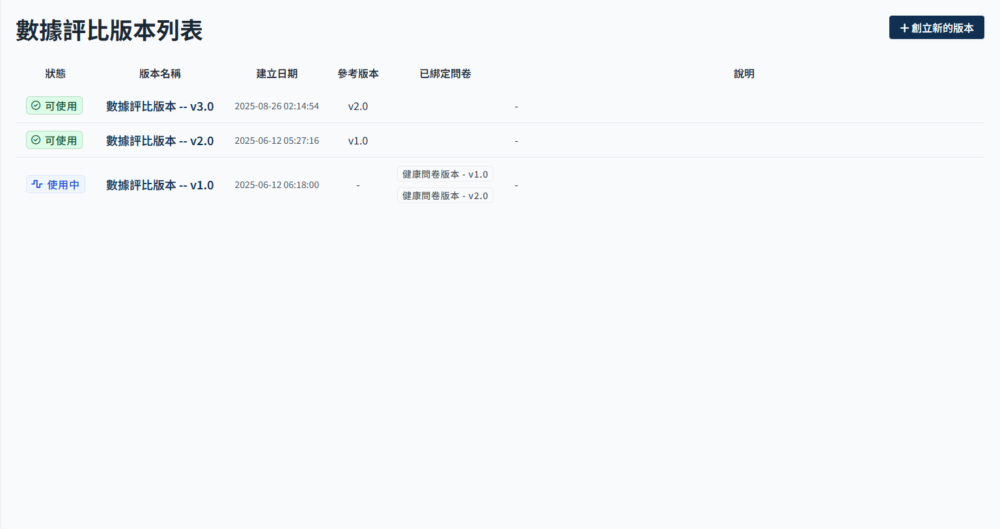
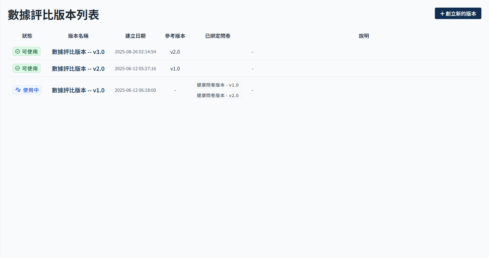

# 數據評比結果

此為健康問卷內最後一個區塊，身體數據及評比內

## 新增數據評比版本

> 帶入目前最新版本內容，自動產生新的數據評比版本，狀態顯示為可使用。

- 進入數據評比版本列表
- 點選 創立新的版本　後，會看到下方表格內多了一個新版本，系統會以最後更新的版本資料帶入產生新的版本。
  

## 編輯數據評比

> 使用中的版本不可編輯。

- 從版本列表點選版本名稱，可進入看該版本內的評比項目。
  
- 狀態為 使用中 的數據評比版本，進入後會看到只能檢視內容，不可新增或者編輯
  

- 狀態為 可使用 的數據評比版本，進入後可以看到操作按鈕，此時可以新增/編輯/刪除評比項目，項目操作參考 [數據評比項目](./transform-subject.md)。
  
