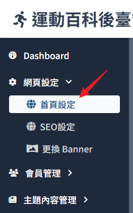
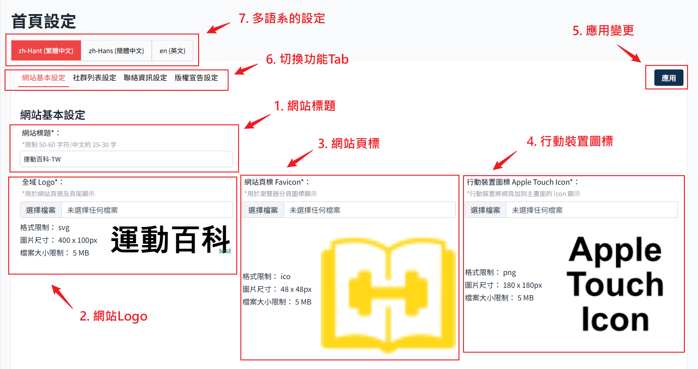
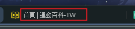
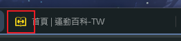
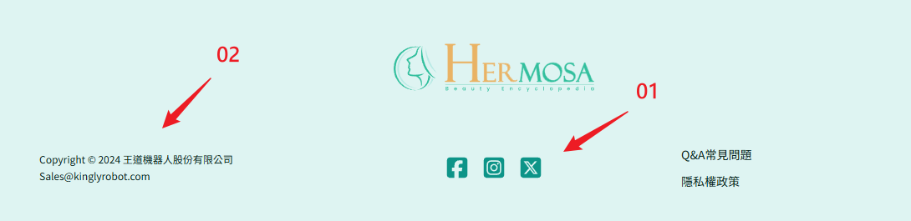
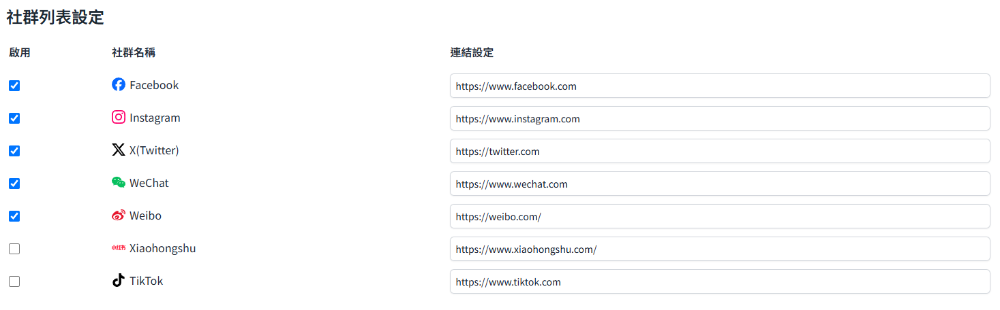
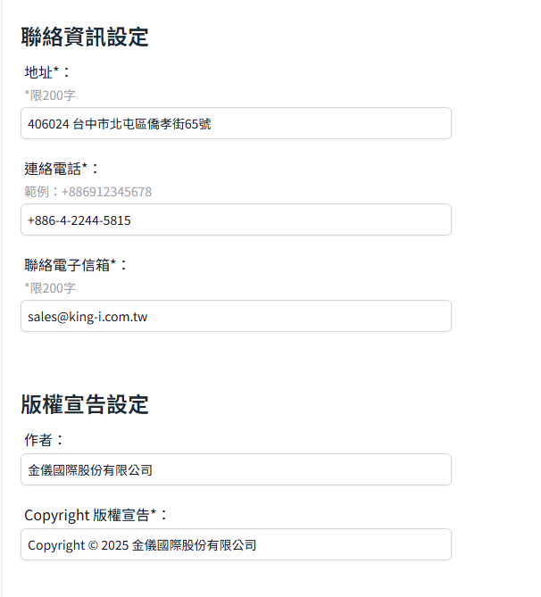

# 首页设定

针对首页显示内容的各项操作设定，包含网站标题、Logo、icon、社群分享、Footer 的内容皆可以自订。
从侧边栏，点选 网页设定 展开后选择 首页设定进入。

## 基本资料

#### 1. 网站标题：

对应前端网站页面标签上显示的名称

#### 2. 网站全域 Logo

显示在画面左上角 Header 的 LOGO 图片

#### 3. 网站页标

对应前端网站页面标签上显示的 icon

#### 4. 行动装置图标

> 参考[行动装置使用流程](http://localhost:7001/kingly_backend_doc/docs/base/web-setting/mobile-device-operating-procedure)。

#### 5. 应用按钮

:::danger 应用到前端网站
这个页面任何变更（包含下方社群以及联络资讯），按应用才会保存且应用到前端网站。
:::

#### 6. 切换功能 Tab

点选后可以快速跳转到此页面其他功能区块，修改后要按应用才会生效。

#### 7. 多语系的个别设定功能 (待开发)

预计之后会需要按照语系设定个别的内容，但目前尚未开发此功能。

## Footer

对应前端网站 Footer 的显示内容

#### 01.社群设定

后台这里可以设定要显示在前端的社群及连结，必须勾选才会显示。

#### 02.联络资讯

设定要显示在前端的公司联络资讯，包含地址、电话、电子信箱等以及版权宣告。

