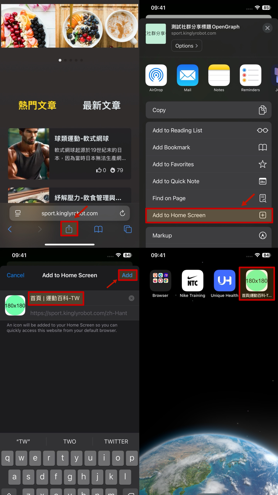

# 行动装置使用流程

此功能可协助使用者将百科网站快速建立为捷径并新增至手机桌面。

## Android 操作说明

1. 进入百科网站后，点选右上角「⋮」功能选单。
2. 选择「加入主画面」。
3. 点选「建立捷径」。
4. 编辑捷径名称后，点击新增。
5. 再次点击自动新增，即可在手机桌面看到捷径。

## Iphone 操作说明

1. 进入百科网站后，点选下方分享icon。
2. 选择「加入主画面」。
3. 编辑捷径名称后，点击新增，即可在手机桌面看到捷径。

