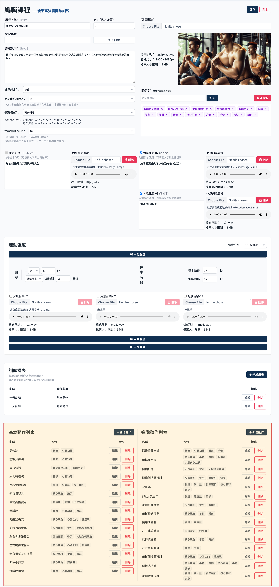
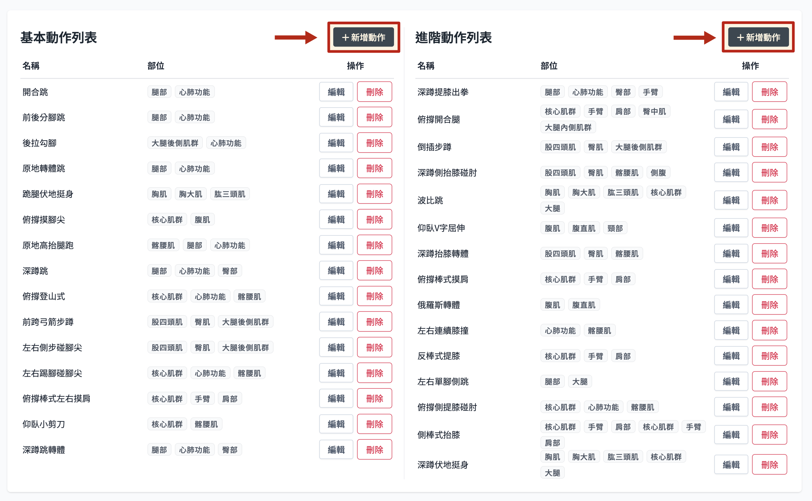
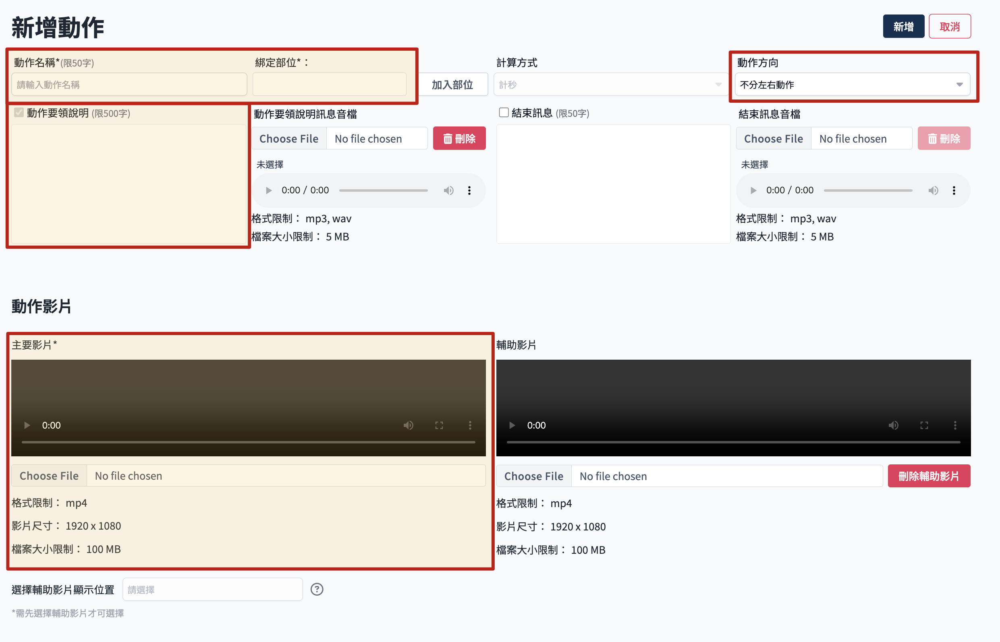
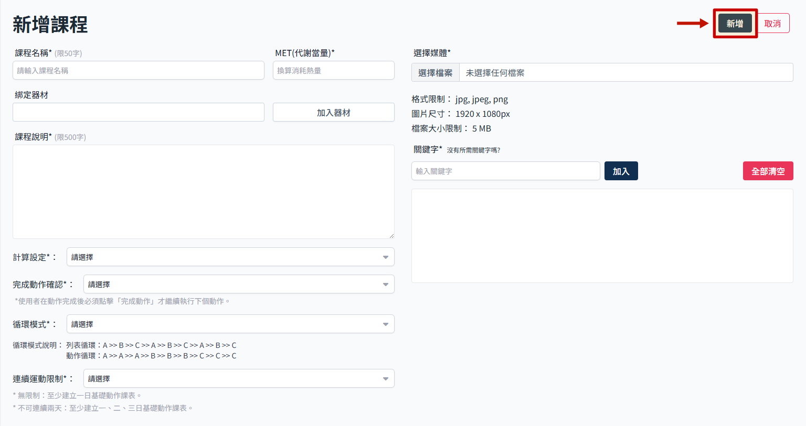
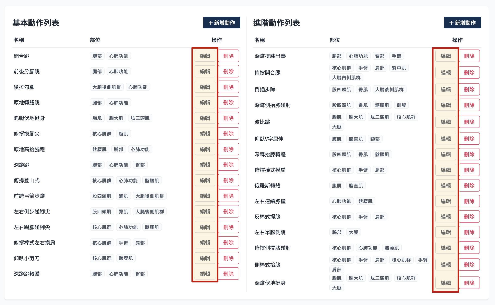
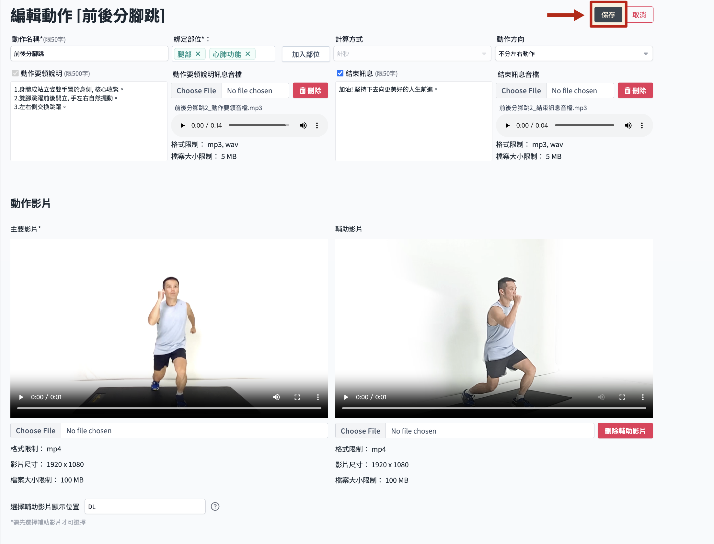
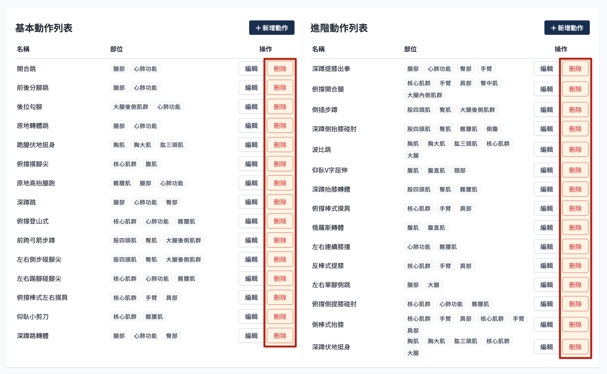
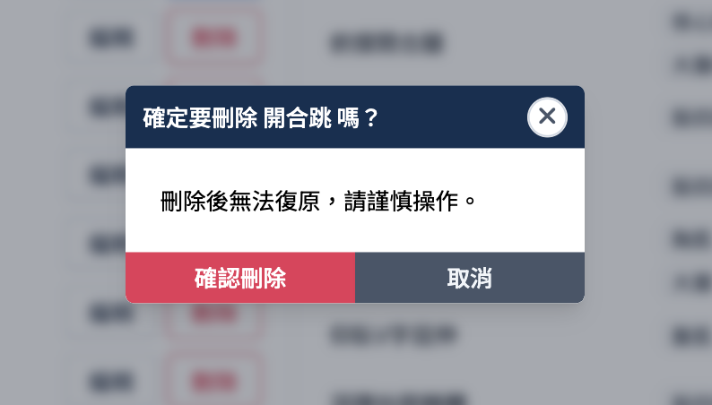

# 动作管理

- 动作是构成运动课程的基本单位，分为基本动作及进阶动作列表。
- 课程资讯页面保存时并没有验证动作数量，但是在设定课表页面内有验证，没有动作会无法新增课表。

> 参考[APP 课程资料结构说明](./course-intro.md)了解课程结构。

## 操作流程

运动课程内下拉到动作列表处，操作动作相关流程。

### 新增动作

1. 点选 新增动作
   

2. 进入动作资讯页面，填写必要的动作资讯。
   
   栏位规范如下：
    - 动作名称：同个课程下动作名称不可重复。
    - 绑定部位：必填，设定动作的部位，部位列表来自部位管理，参考 [新增部位](../body/add-body-part.md)。
    - 动作方向：设定是否分左右动作，若选择区分左右动作，须分别上传左右动作影片。
    - 动作要领说明：仅限制文字必填，音档不限制。
    - 动作影片
    - 主要影片：必填。
    - 辅助影片：选填。
    - 辅助影片显示位置：有设定辅助影片时才需要选择。

3. 点选 新增，完成动作新增。
   

### 编辑动作

基本同新增动作。

1. 点选 编辑
   

2. 进入动作编辑页面，栏位限制同上新增动作。
   

3. 完成编辑后点选 保存，完成动作编辑。
   

### 删除动作

1. 点选要 删除 的动作
   

2. 点选 确认删除。
   :::danger
   删除后无法还原，请谨慎操作。
   :::
   
