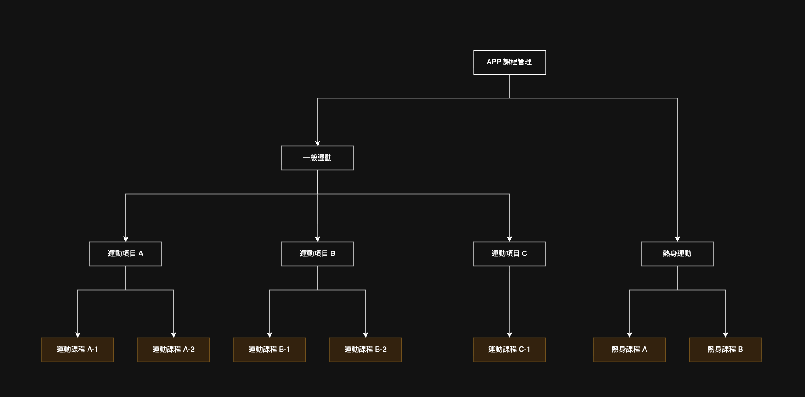
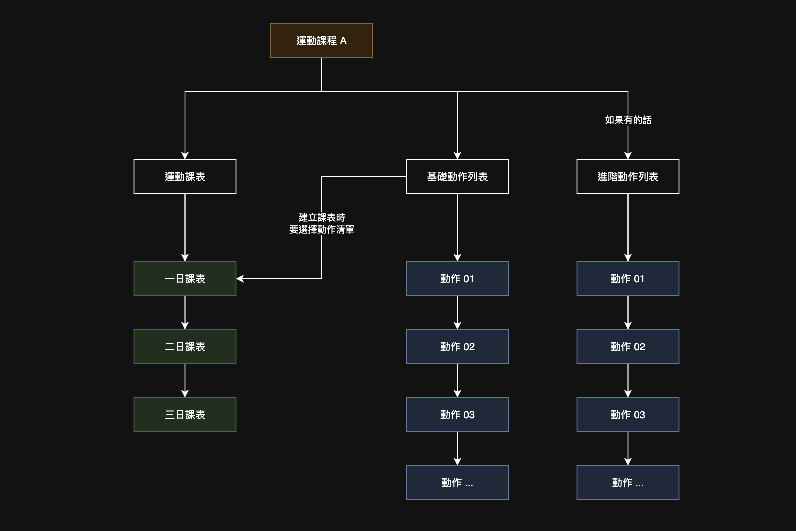

# APP 课程资料结构说明

课程结构：运动项目 → 课程 → 课表 → 动作

运动分为两个类型：热身运动及一般运动，主要差别在于热身运动不会进入课程推荐清单内，且热身运动就是一个运动项目，课程内只需要一日课表；一般运动分为多个运动项目，每个项目内可增加多个课程。

## 限制说明

- 无连续限制的课程的课程至少须建立一日课表，有连续限制的课程需要建立一到三日的课表，否则课程没有完整资料，在健康目的那里无法被设定对应关系。参考 [运动课程](./course-manage.md)。
- 必须先有动作才能设定课表。参考 [运动课表](./schedule.md)。
