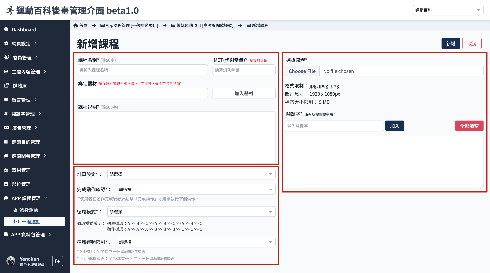
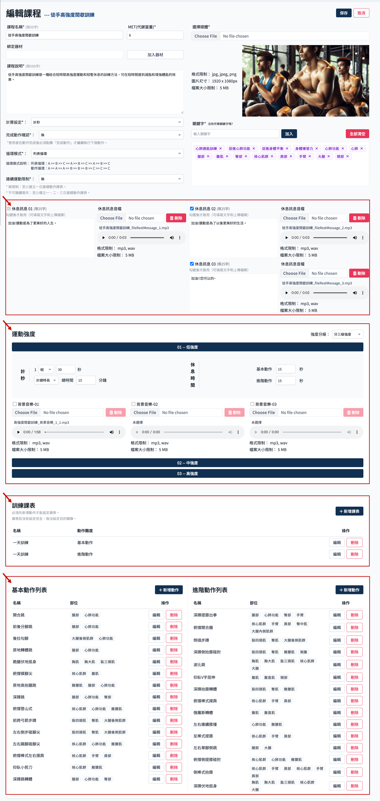
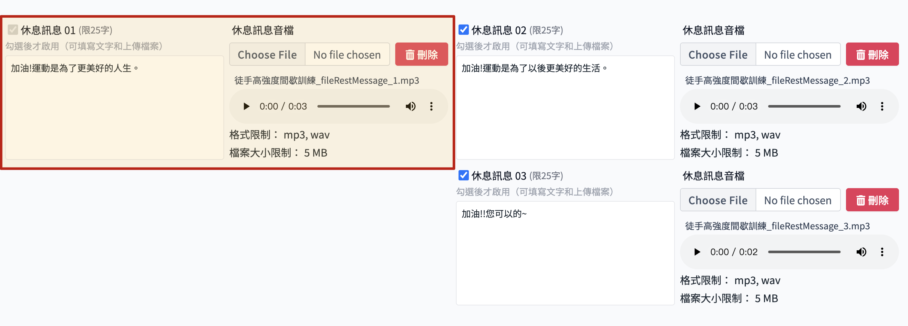
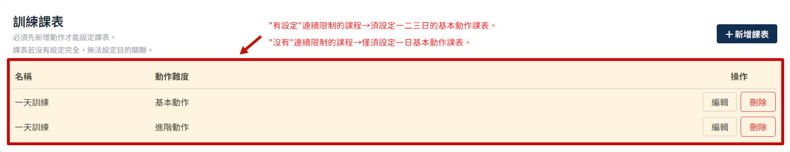
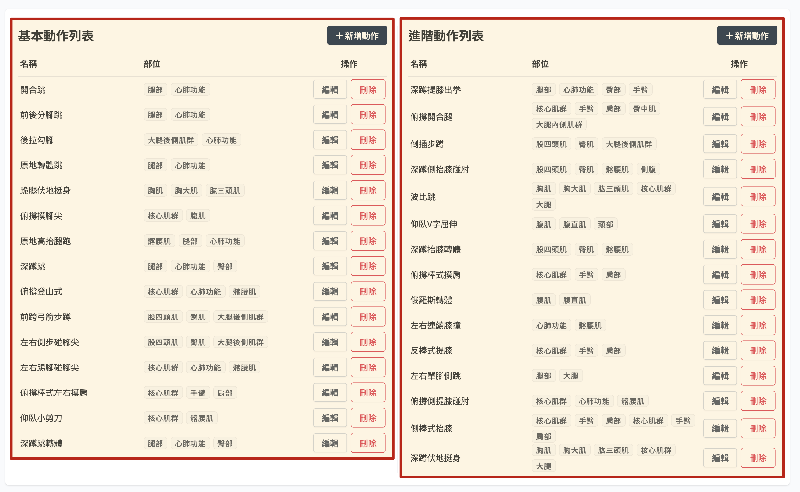
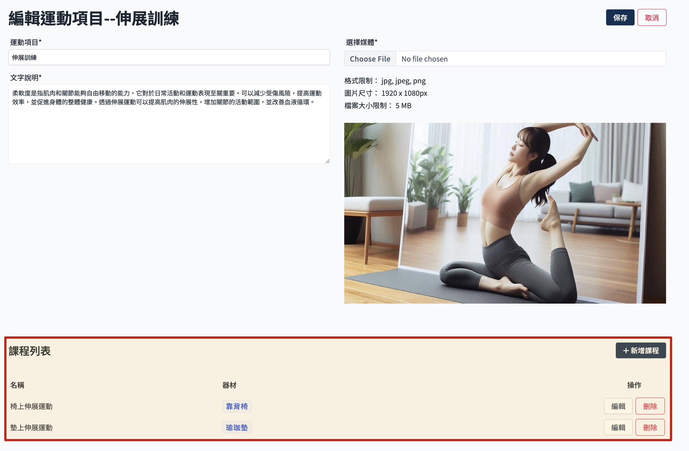

# 运动课程

运动课程及[热身运动](./warming-course.md)的操作都相同，只是性质差异所以把热身运动独立在外。

> 参考[APP 课程资料结构说明](./course-intro.md)了解课程结构。

## 操作流程

课程这边因为要填写的内容很多，所以在新建课程的时候会分两阶段建立资料，第一阶段先填写课程的基本资讯，建立课程后，再点击编辑课程，才可新增动作以及课表。

### 新增运动课程

1. 从运动项目内，点击新增课程，开启新增课程页面
   

2. 填写基本资讯，课程资讯各栏位的限制规范：
   
    - 课程名称：必填，不可与其他运动项目内的课程名称重复。
    - MET 代谢当量：必填，换算热量使用。
    - 绑定器材
    - 必须在器材管理先建立器材，这里才能调整。参考 [新增器材](../equipment/add-equipment.md)。
    - 是否有设定器材会影响使用者筛选条件。
    - 最多可设定三项器材。
    - 课程说明：必填，限 500字内。
    - 图档：必填，有档案大小及尺寸限制。
    - 关键字：必填，看后续是否会以关键字作为搜寻或筛选判断。
    - 计算设定
    - 可选择计次或者计秒，主要影响运动强度设定的单位。
    - 循环模式设定
    - 组数重复：A >> A >> A >>　 B >> B >> B >>　 C >> C >> C
    - 回合重复：A >> B >> C >> 　A >> B >> C >>　 A >> B >> C
    - 完成动作确认
    - 每个动作需要点击确认后才执行下一个动作。
    - 连续运动限制
    - 无限制：至少须建立一日课表。
    - 不可连续两天：至少须建立一、二、三日的基本动作课表。

3. 点选新增
   

### 编辑运动课程

- 在运动项目列表内点选 编辑。
  

- 进入完整的 课程设定页面，以下分区说明各自的限制。
  

#### 休息讯息

- 至少需要设定 休息讯息01，最多可设定三个。若有多个休息讯息，会全部提供给前端使用。
- 文字栏位为必填，音档不限制。

#### 设定运动强度

- 分为固定强度、三级、五级，影响下方强度设定栏位。

- 间歇休息时间
  动作与动作之间的休息时间，预设 0 秒。

- 强度设定
- 可设定计次与计秒情况下每个动作的运动组数及次数。
- 每个强度至少都需要设定一个背景音乐。

#### 训练课表

- 有设定连续限制的课程，须设定一二三日的基本动作课表才能通过资料验证。
- 没有连续限制的课程，仅须设定一日基本动作课表。

#### 动作列表

- 详见[动作管理](./action-manage.md)
- 分为基本动作及进阶动作列表。
- 课程资讯页面保存时并没有验证动作数量，但是在设定课表页面内有验证，没有动作会无法新增课表。

### 删除课程

1. 进入运动项目内，课程列表
   

2. 点选 删除
   

3. 点选 确认删除。
   :::danger
   删除后无法还原，请谨慎操作。
   :::
   
