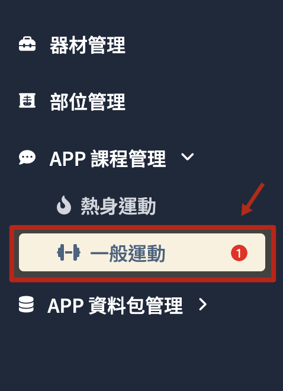
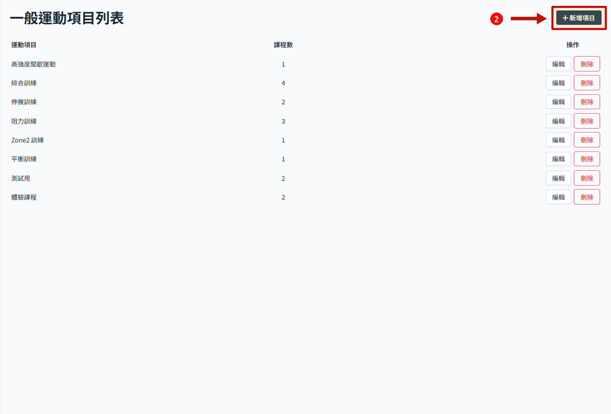
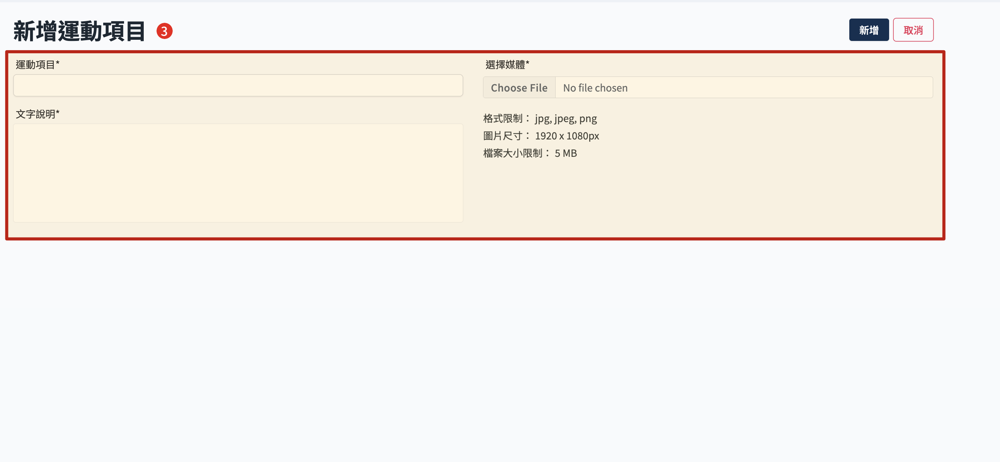
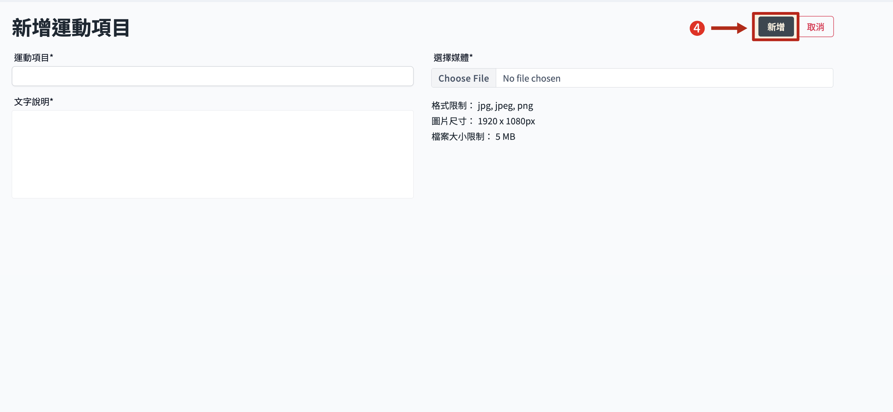
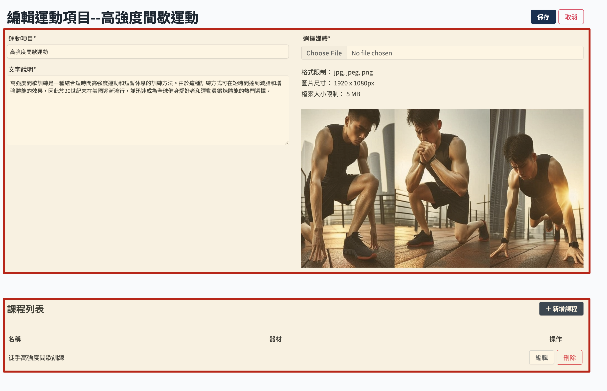
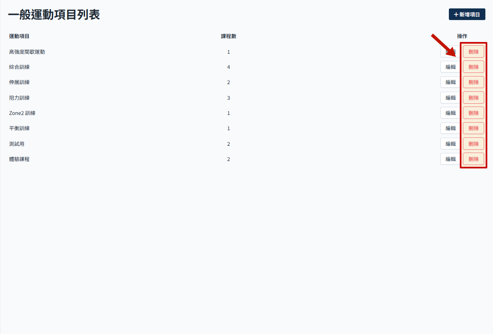

# 运动项目管理

> 关于课程结构参考 [APP 课程资料结构说明](./course-intro.md)

## 操作流程

### 新增运动项目

增加新的运动项目，运动项目之下可以新增运动课程。

1. 从 sideMenu 点击 APP 课程管理，展开选单后，点击 一般运动 进入一般运动项目列表
   

2. 点选 新增项目
   

3. 填写运动项目资讯
   

4. 点选 新增 即保存
   

### 编辑运动项目

1. 点选 编辑 目标运动项目
   

2. 进入运动项目页面，可以修改项目资讯，下方可检视该项目内的运动课程列表。课程管理参考 [运动课程管理](./course-manage.md)。
   

### 删除运动项目

1. 点选 删除 目标运动项目
   

2. 二次确认弹窗，点选 确认删除
   :::danger
   删除后无法还原，请谨慎操作。
   :::
   
