# 运动课表

> 参考[APP 课程资料结构说明](./course-intro.md)了解课程结构。

## 栏位说明

- 课表天数：可选择一到三日，不可重复建立，系统会自动判断已建立过得不可选择。
- 动作难度
    - 可选择基础动作或进阶动作。
    - 若所选择的动作清单内动作数量为零，保存时会回报无法新增/储存课表。
- 每日动作数量
    - 影响下方课程预览建立产生的动作数量
    - 数量限制：此设定仅在 APP 内作用，限制使用者新增删除动作的调整空间。
- 重复限制
  两天以上的课表才可选择。
    - 动作不重复
    - 部位不重复：选择部位不重复时，若有动作设定多个部位，任一部位皆不可重复。

- 动作排序
    - 随机排序:按照上方栏位的限制设定，系统自动排列动作清单，有一定随机性。
    - 固定排序:需点击旁边课表预览建立，会按照这里所显示的动作清单提供给使用者。

## 操作流程

从课程资讯内，训练课表区块，可选择 新增 或者编辑已经设定的课表。每个课程至少需要有一天的基础动作课表，若是有连续限制的课程，则是需要建立一二三日的基础动作课表。
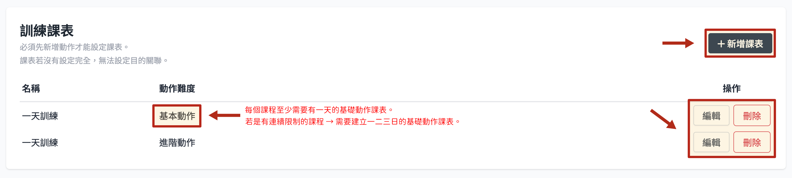

### 设定随机排序课表

1. 选择天数
2. 选择动作难度
3. 填写动作数量
4. 设定重复限制，在生成课表的时候会按照限制排除
5. 动作排序选择 随机排序
6. 点选课表预览建立，这里可以看到课表大概会是怎么样，但不会保存内容，使用者每次进入课程都会依照设定条件由系统产生课表，有一定随机性。
   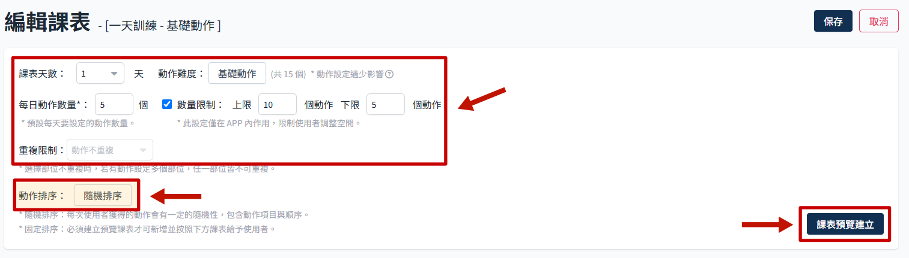
   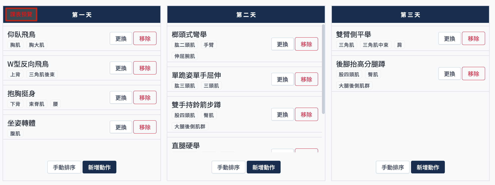

### 设定固定排序课表

主要是针对部分课程需要规范动作执行顺序，才需要自订调整每天的动作清单。

1. 选择天数
2. 选择动作难度
3. 填写动作数量 -> 固定排序基本上都需要设定动作，所以这边随便写数字都可
4. 设定重复限制，在生成课表的时候会按照限制排除
5. 动作排序选择 固定排序
6. 点选课表预览建立
7. 这时下方会按设定先行产生一个课表，此时可以自行设定动作顺序
   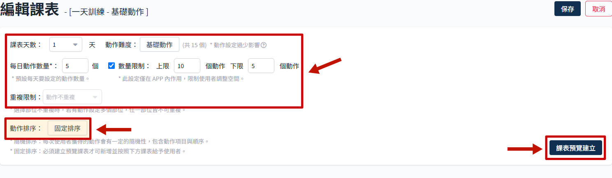
   

- 更换：点选后可以从上面设定的动作列表内选择其他动作替换
  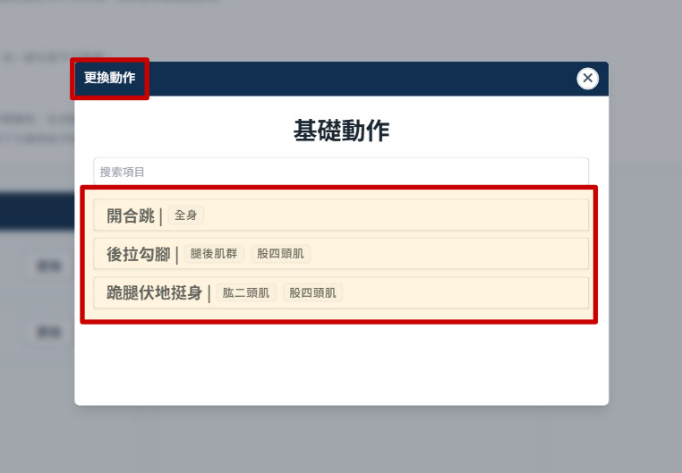
- 移除：移除此动作，会出现确认弹窗。
  
- 手动排序：可以调整动作顺序
    1. 点选手动排序
       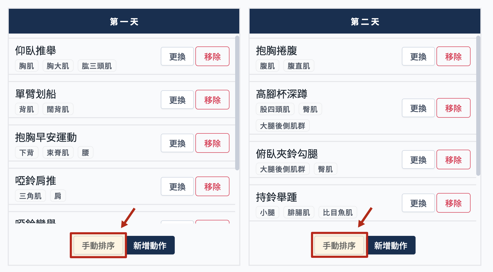
    2. 可拖曳动作调整顺序
       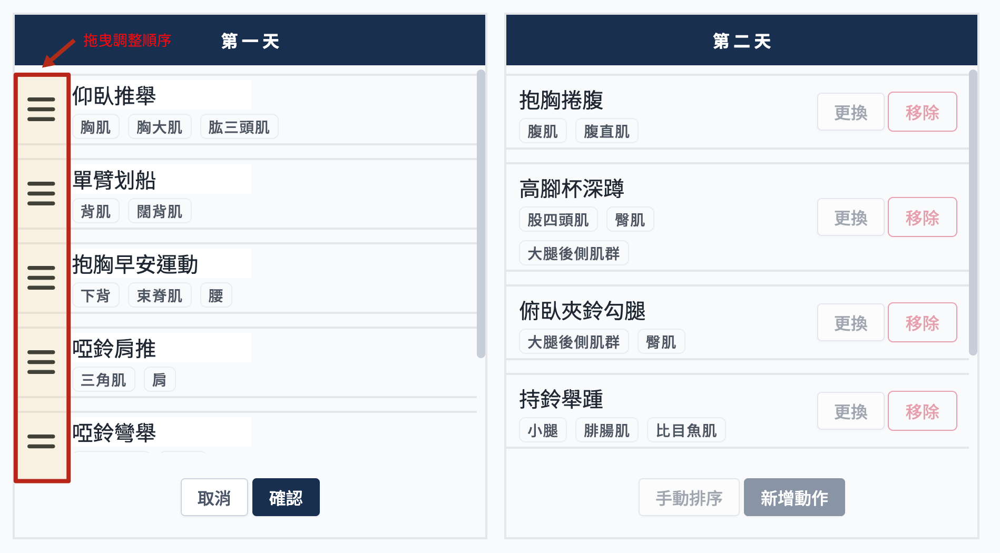
    3. 点选 确认，保存顺序
       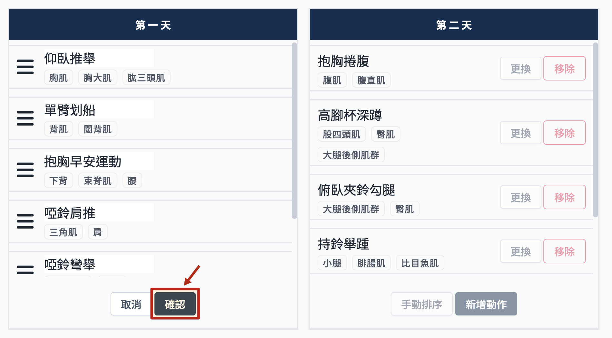
    - 新增动作：点选后会有弹窗显示动作列表，可选择要加入的动作
      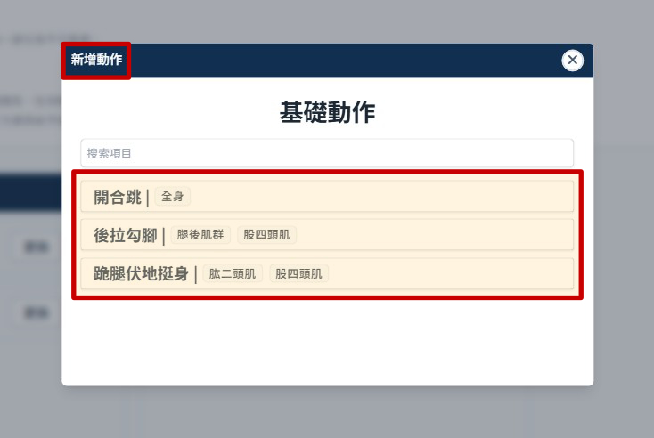

## 删除课表

1. 点选要 删除 的课表
   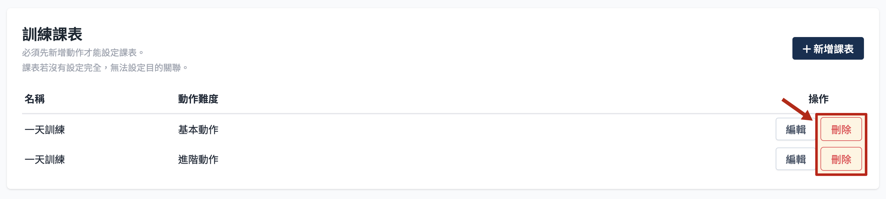

2. 点选 确认删除。
   :::danger
   删除后无法还原，请谨慎操作。
   :::
   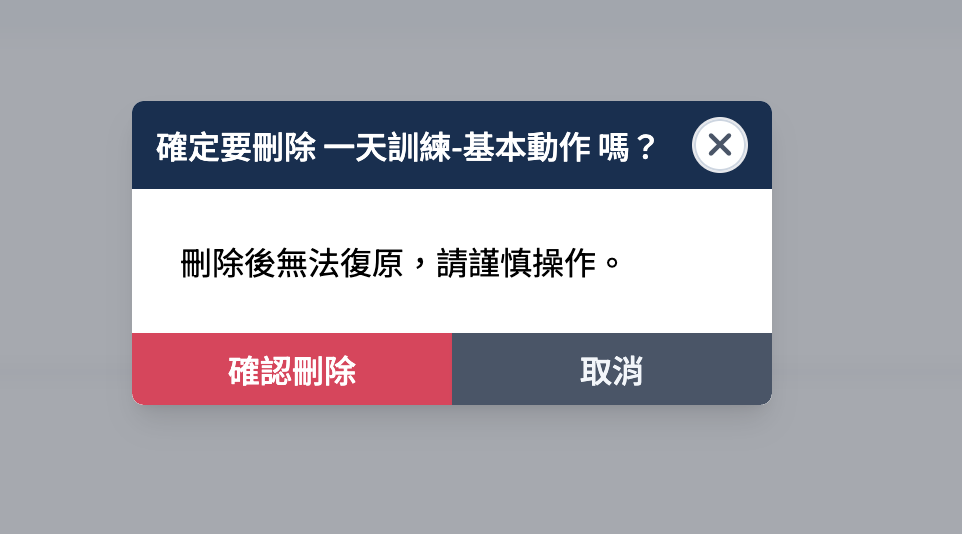
