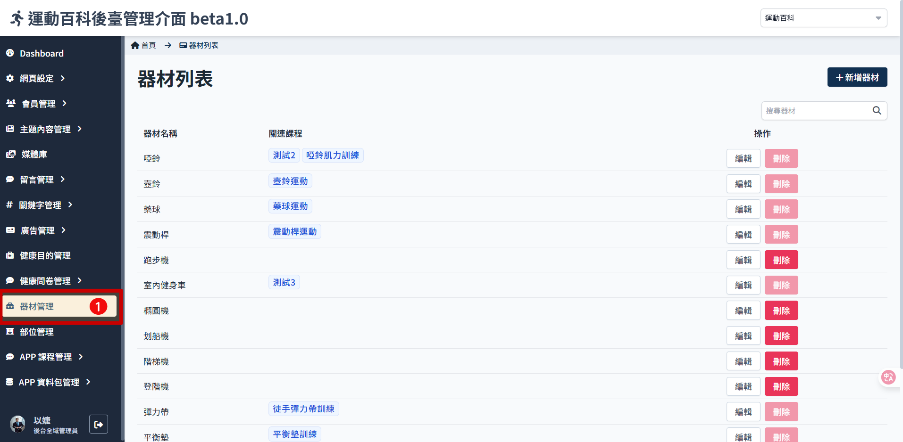
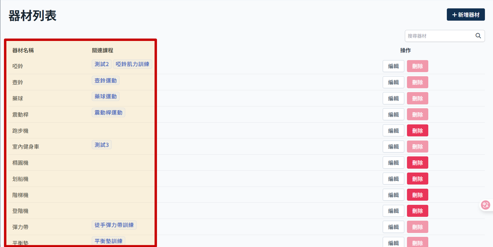
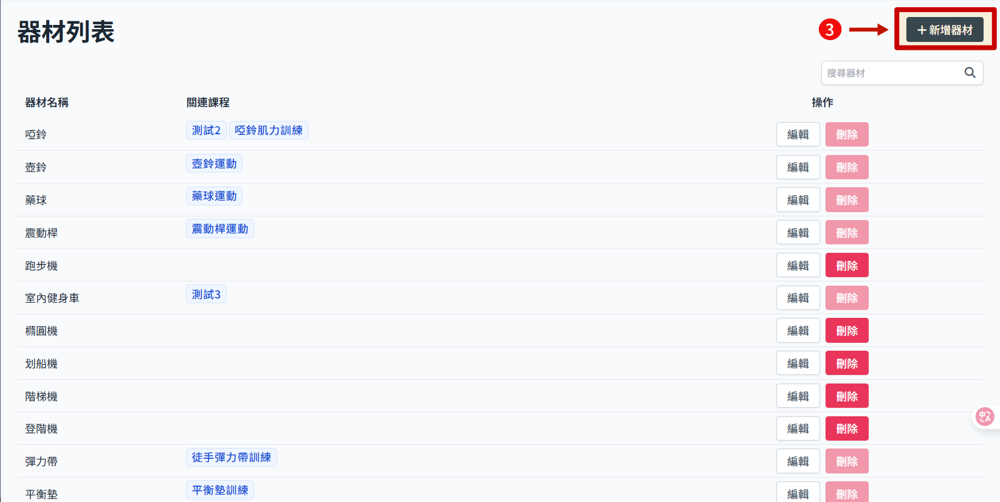
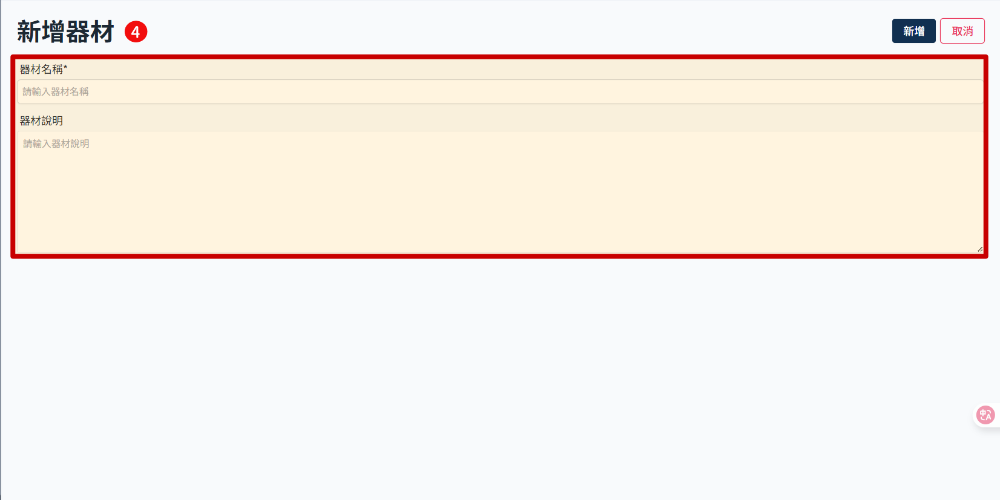
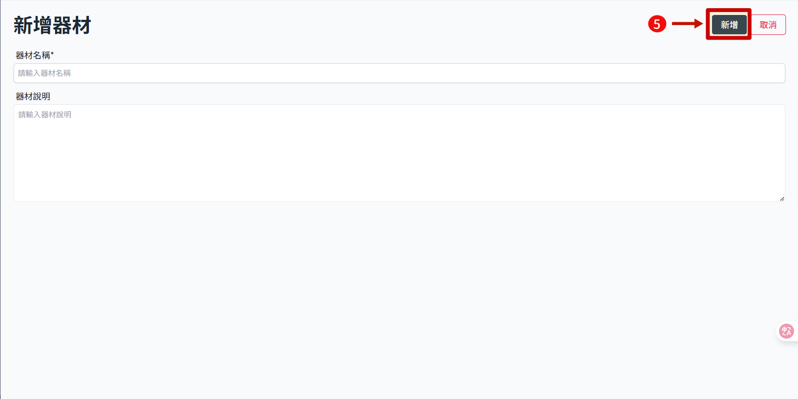
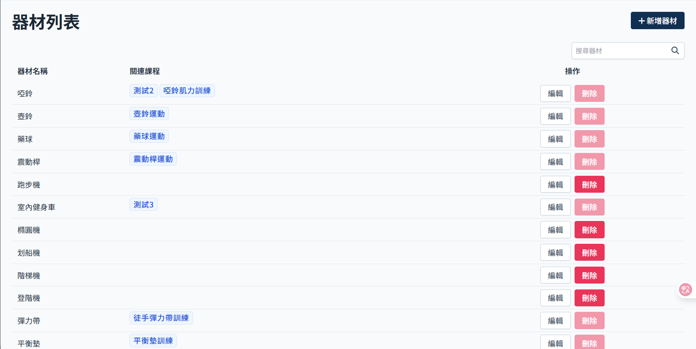

# 新增运动器材

> 器材用于课程内设定使用，主要影响筛选课程的条件。使用者如果没有选择器材，推荐课程时就会把有绑定该器材的课程排除。

1. 点击侧边栏 器材管理 进入 器材列表
   
2. 部位列表显示器材名称及已关联的课程
   
3. 右上角点击 新增器材
   
4. 填写 器材名称/说明。注意名称不可与已有的器材重复。
   
5. 点击 新增
   
6. 新增成功
   
