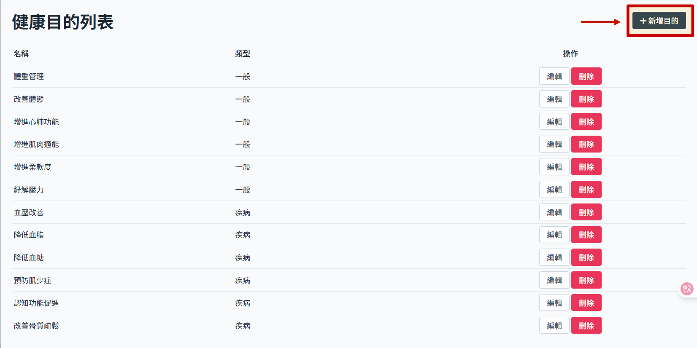
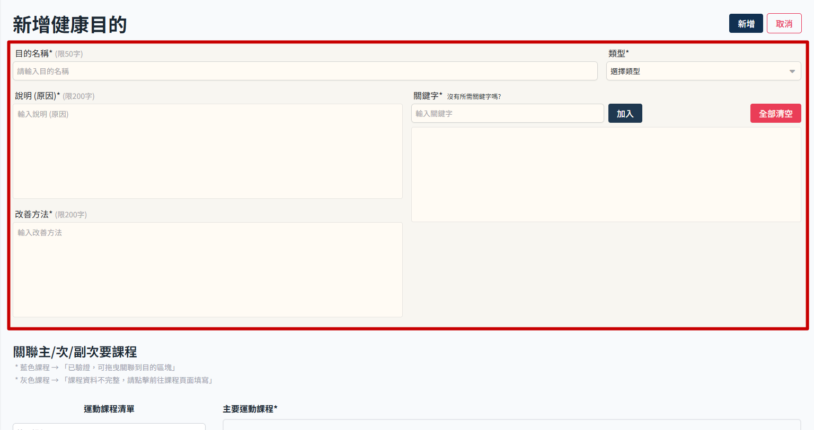
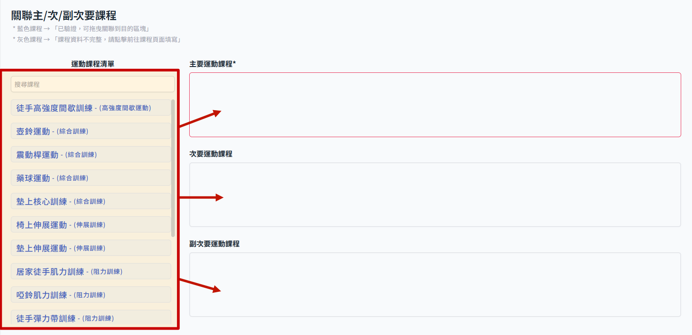

# 新增健康目的

> 先新增课程后再来操作健康目的，因为如果没有绑定主要课程，健康目的无法正确送出。

## 操作步骤

1. 从　sidemenu　进入健康目的管理
   
2. 此时画面会显示健康目的列表，点选新增目的
   

3. 新增健康目的页面，填写目的说明等基本资讯
   

4. 设定关联课程，使用拖曳方式把课程放到对应的栏位即可
   

> 这边涉及课程本身资料完整性，若不完整就无法设定，详细状态规范参考 >> [设定健康目的对应课程](set-recommend-course.md)

5. 右上角点选 新增 即完成步骤
   
