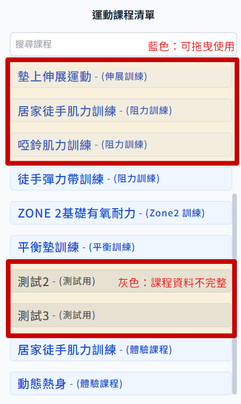
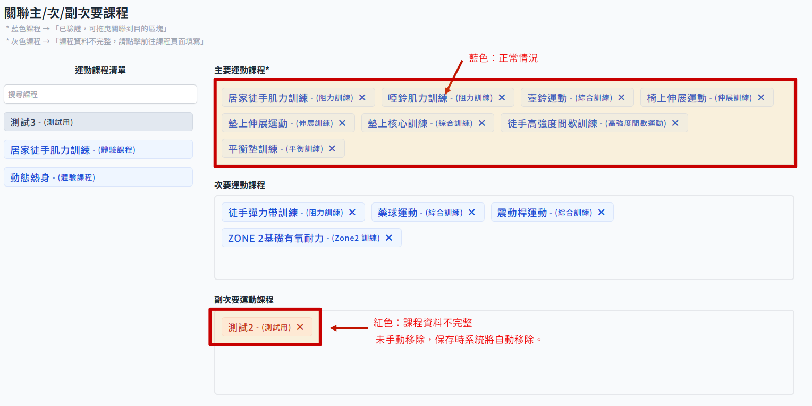

# 设定健康目的的对应课程

在新增或者编辑健康目的时，课程本身资料完整性会影响是否可以设定健康目的。

## 课程清单标示状态说明

- 在课程清单这边会以颜色标示是否可以拖曳设定，蓝色为可以使用，灰色即代表课程资料不完整。
  

- 在编辑健康目的页面，正常情况下都会显示蓝色，若是因为后续课程内资料异动而导致资料不完整，会显示红色；红色标示的课程若没有手动移除，会在点击 保存变更 的时候会自动移除关联。
  
