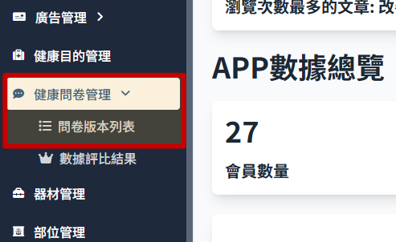
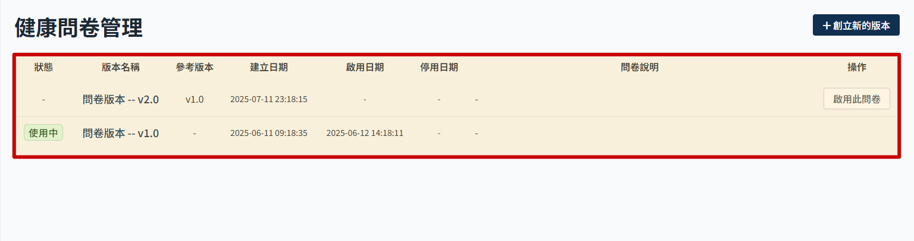
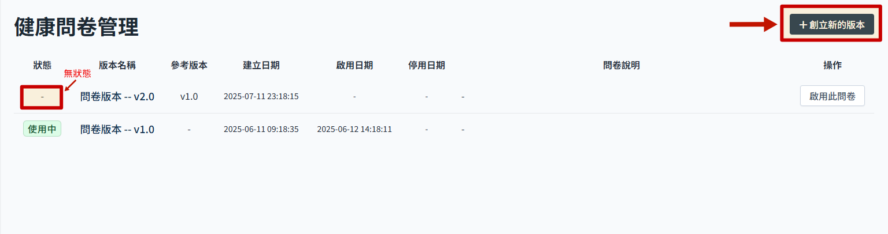
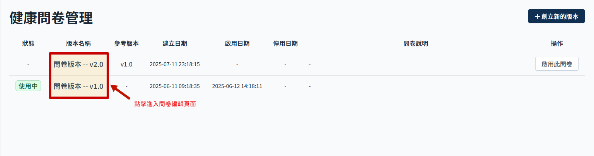
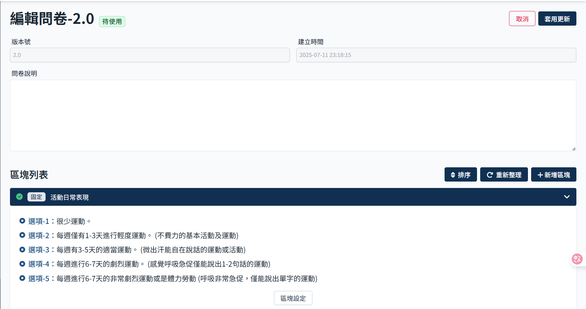

# 新增问卷版本

1.  点击侧边栏 健康问卷管理 进入 问卷版本列表
    

2.  列表显示
    

3.  右上角点击 创立新的版本，下方列表即会新增一个新的问卷版本，显示无状态。

> 若是已有无状态的问卷，即无法新增成功

4.  点击 问卷版本名称，可进入问卷编辑页面 > 只有无状态的问卷可以编辑，其他状态的页面虽然可以进入编辑页，但内容无法编辑。
    

5.  问卷编辑页面
    
