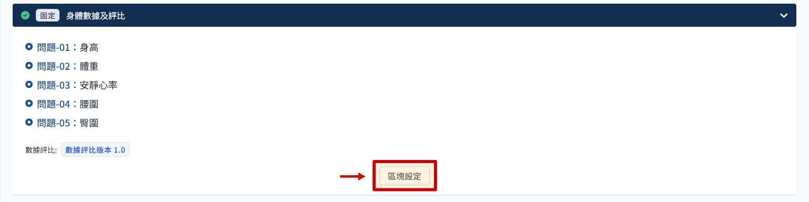
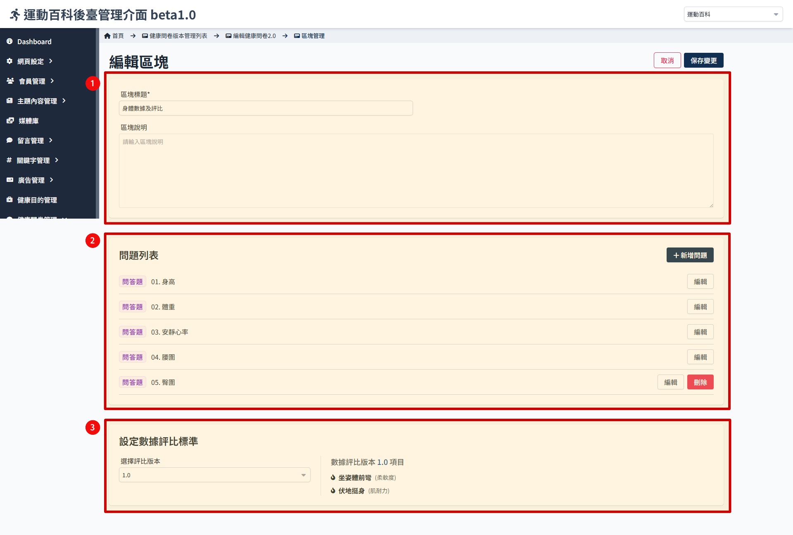

# 身体数据区块

> 这个区块主要是询问使用者基本身体数据以及肌耐力／柔软度调查，以便后续评估给予运动强度建议。

## 进入区块设定

- 点选 区块设定
  
- 进入后看到此页包含三个区块:

1. 基本资讯：可调整区块名称与补充说明。
2. 问题列表：已设定的问题列表。
3. 设定数据评比标准，每个问卷可以绑定一个版本的评比标准。

### 新增／编辑／删除问题

- 问题的设定操作同 [编辑一般区​​块](./normal-block.md)。
- 列表内原则上可新增任意问题，注意先了解评比标准有哪些项目，避免询问重复问题，这里询问的问题仅作为纪录，无法做后续的判断。

### 绑定数据评比标准

这里可绑定数据评比标准，数据评比的设定参考 [数据评比结果](./transform-version.md)。

依照下拉选单选择的版本，右侧会显示该版本内的评比项目。同个评比版本可以被多个问卷绑定。

