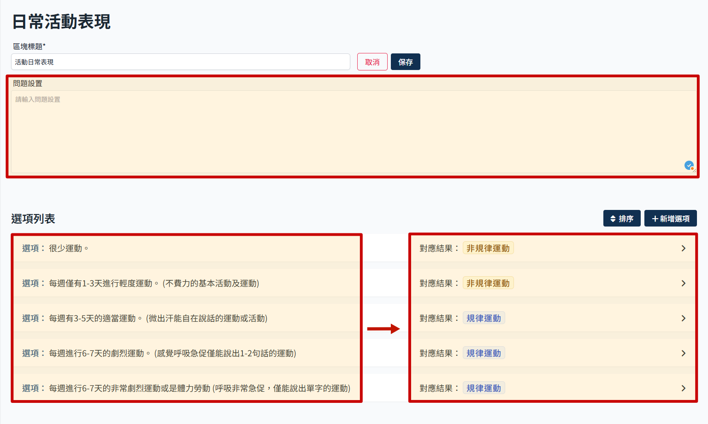
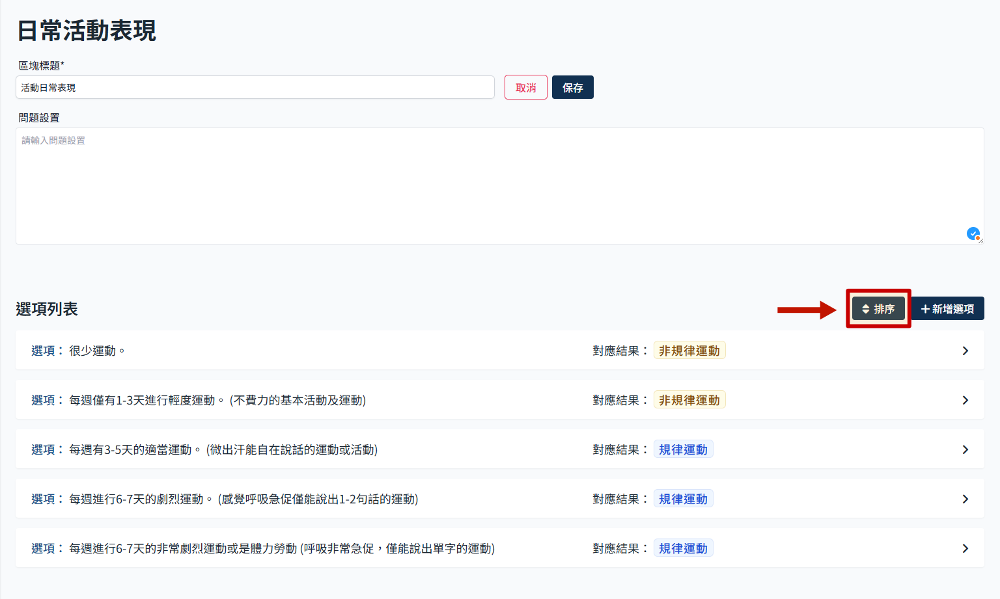
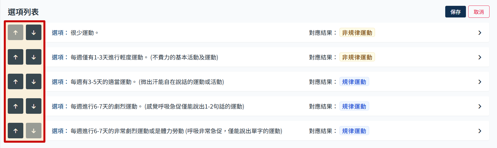
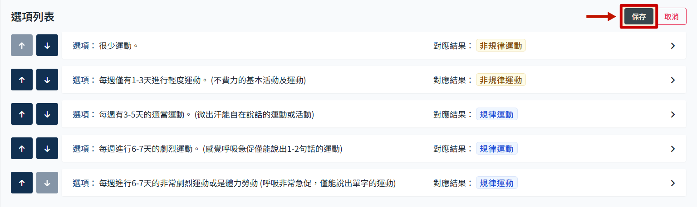
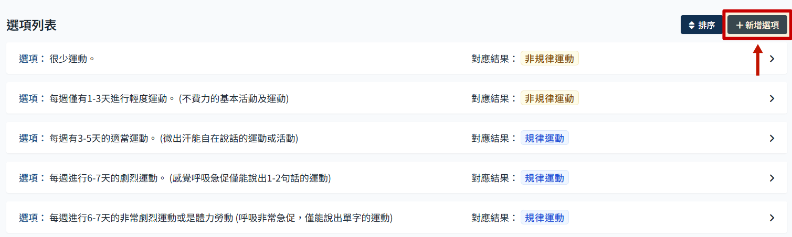
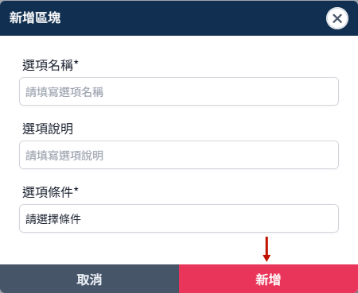
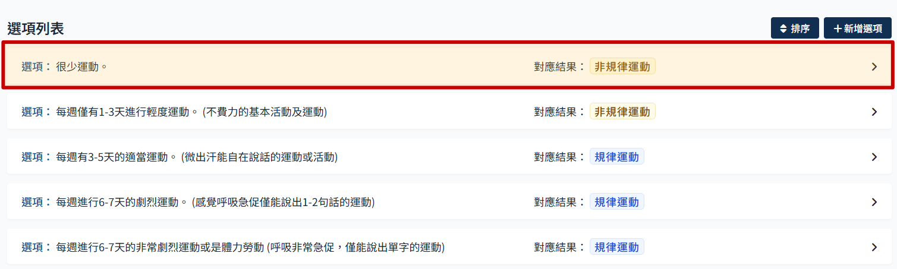
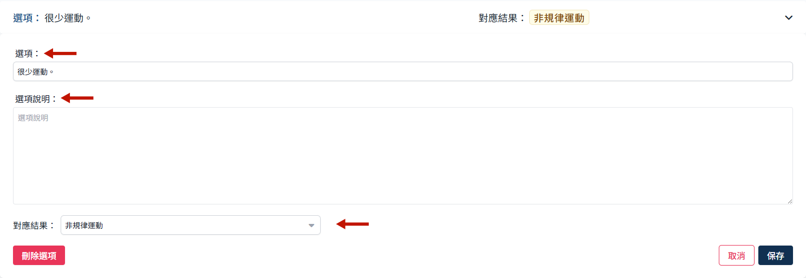
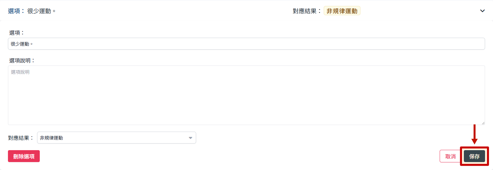

# 活动日常表现区块

此活动区块只有一个问题，选项部分必须要设定对应结果。

### 排序

- 点选排序
  

- 使用箭头调整顺序
  

- 点击保存
  

### 新增选项

- 点击 新增选项
  

- 会跳出新增选项的弹窗，填写完后点选 新增 即可
  

### 编辑选项

- 点选选项，可展开编辑框
  

- 展开后可编辑选项名称以及加入附加说明、设定该选项的对应结果。
  

- 编辑完成后点选保存
  
