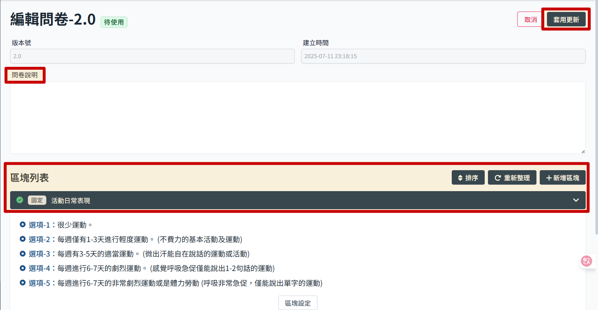
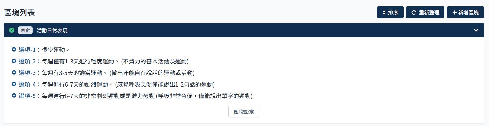
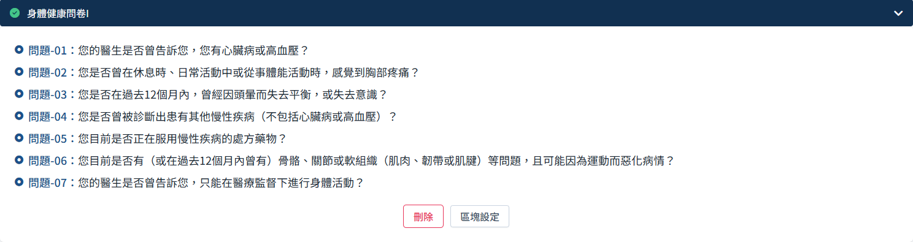
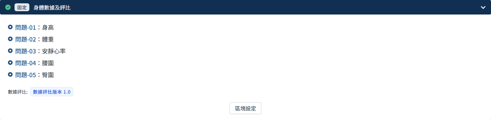
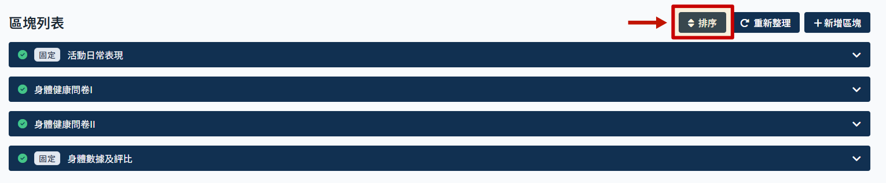
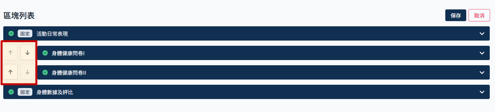
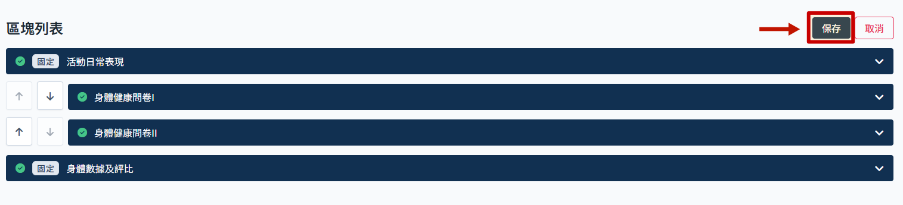
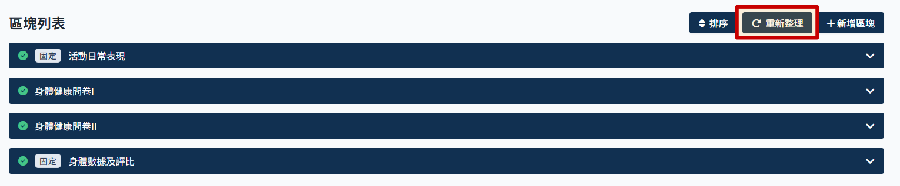

# 编辑问卷内容

> 问卷显示无状态的时候才可编辑问卷内容，其余状态只能检视内容。参考 [健康问卷状态说明](./questionnaire-status.md)。

点击无状态的问卷，进入问卷编辑页面。

## 区块操作说明

- 问卷可添加说明，版本号及建立时间会由系统自动带入。
- 做任何变更记得都要点选套用更新。
- 可分为三种不同类型区块，其中活动日常表现以及身体数据为固定区块，不可调动顺序，也不可删除，其余区块才可新增删除及排序。

### 活动日常表现

操作参考 [编辑活动日常表现](./daily-block.md)。

### 身体健康问卷（一般区块）

操作参考 [编辑一般区​​块](./normal-block.md)

### 身体数据评比

操作参考 [编辑身体数据区块](./body-block.md)

## 其他操作

### 区块排序

日常活动表现与身体数据评比为固定区块，除此以外的区块可以调整顺序，若没有特别设定区块跳转条件，就是按照排序执行。

:::warning 排序限制
只有一般区块可以排序。
务必确定区块内是否有自订义排序，逻辑是否有冲突。
:::

- 点选 排序
  

- 点击 箭头调整顺序
  

- 点击 保存 完成操作
  

### 重新整理功能的使用情况

完成区块设定后，问卷内容这个页面问题并不会即时更新，这时候点击重新整理可刷新问题列表。

