# 编辑一般区​​块

身体健康问卷这个区块即为一般类型，如果有新增区块的话都会是这种，可以新增不同的问题类型。

- 点选区块设定
  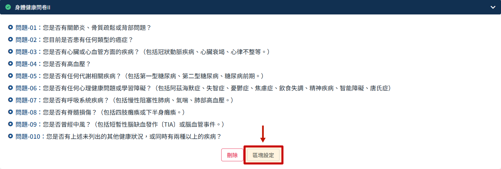

- 区块编辑页长这样，大致可分为问题列表以及页面跳转条件设定两个区块
  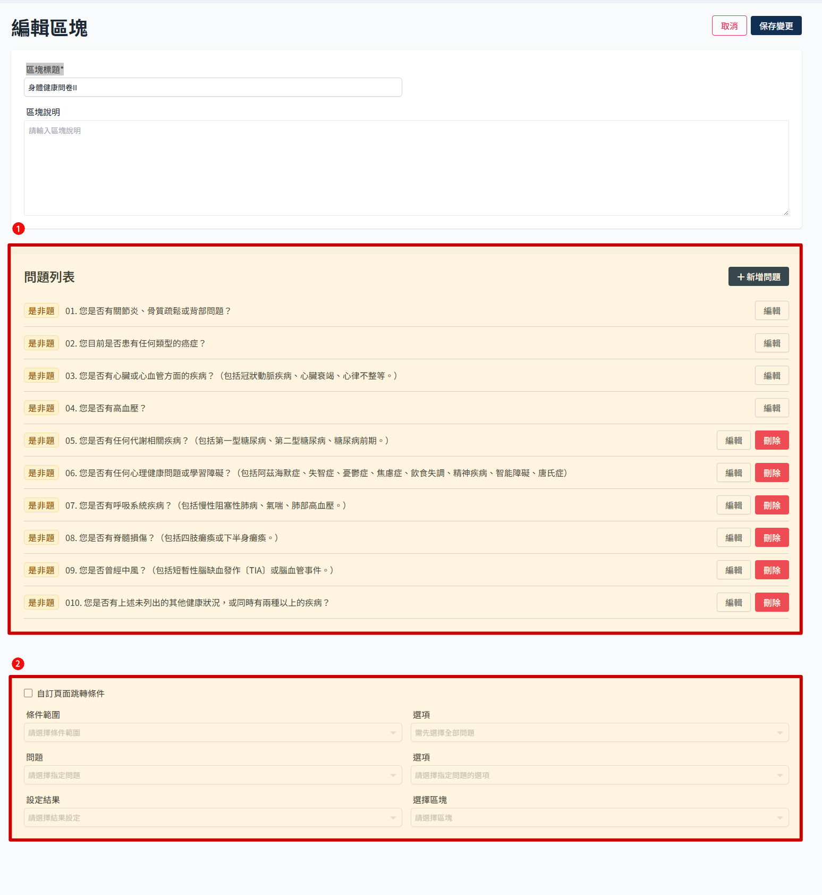

## 基本操作流程

### 新增问题

- 点选 新增问题
  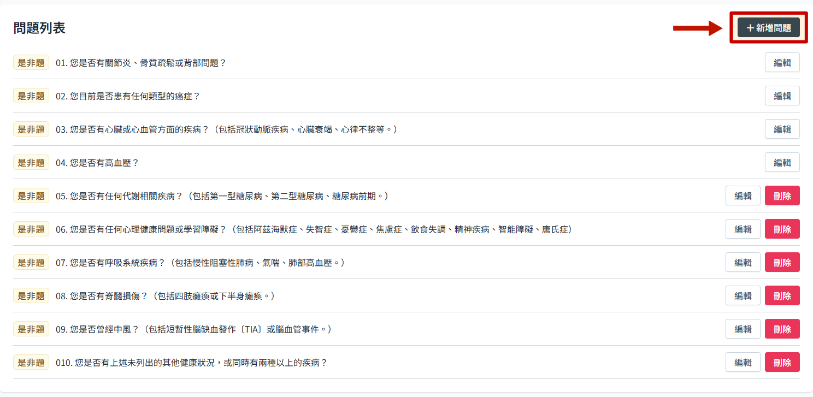

- 弹窗内可选择问题类型，会依照类型显示不同栏位
  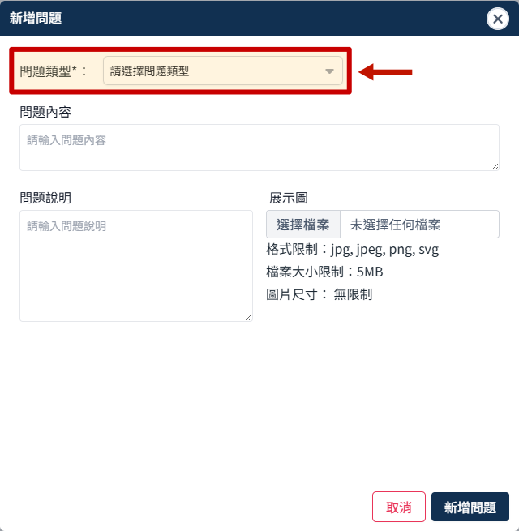
    - 问答题：适合用来询问身体数据
      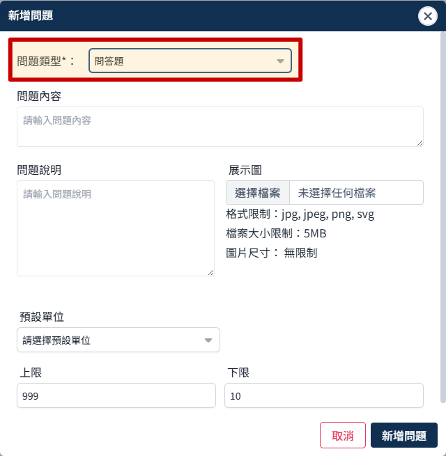
    - 是非题：询问疾病史与健康状态
      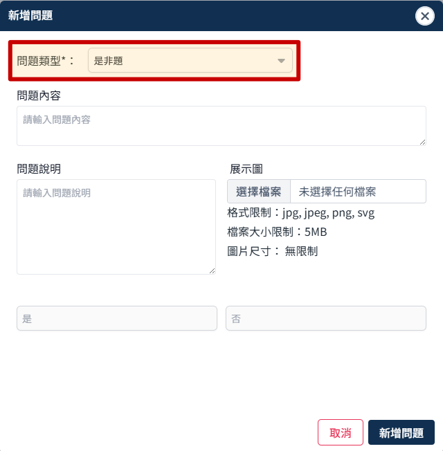

- 填写内容后点选 新增问题
  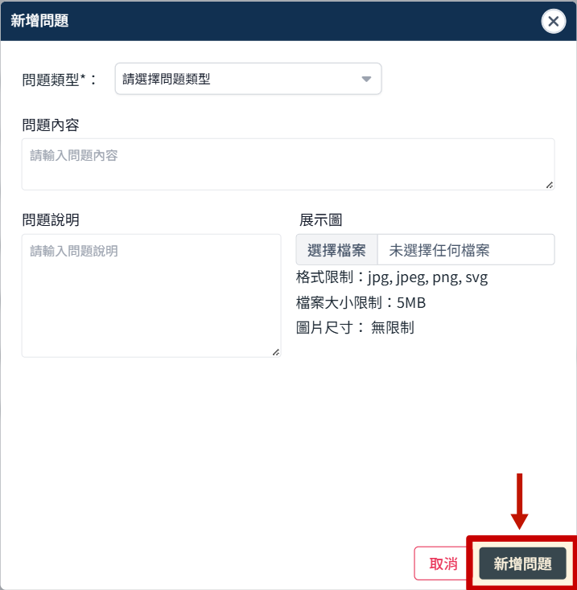

### 编辑问题

- 点选 编辑
  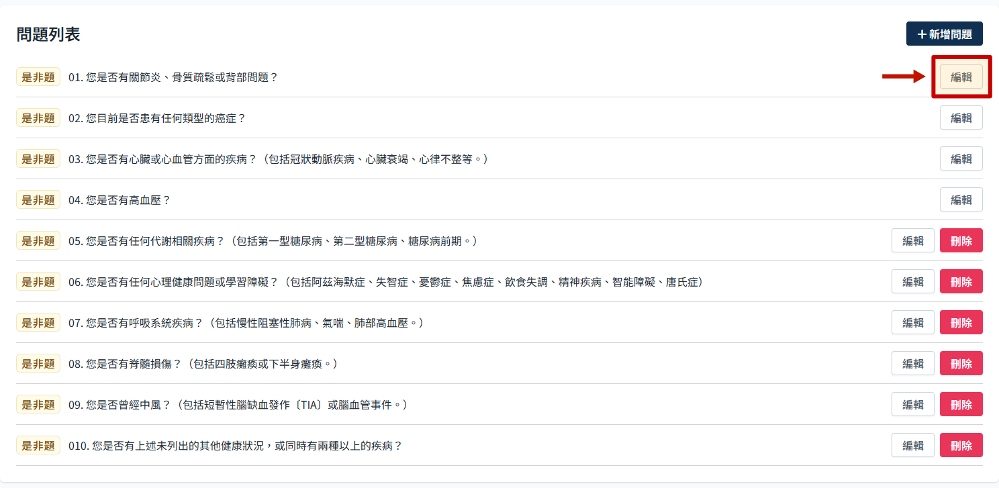

- 原则上与新增问题相同，各项栏位皆可调整
  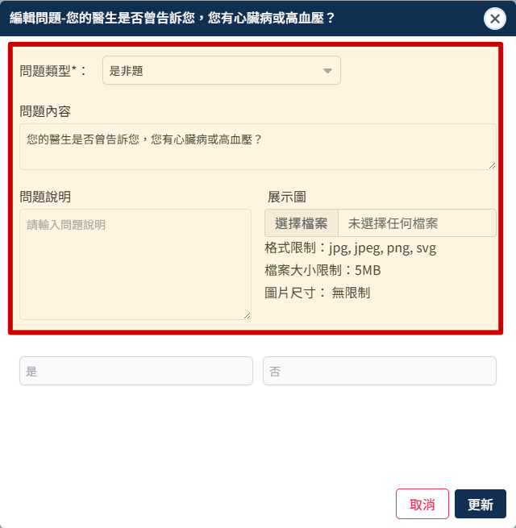

### 删除问题

- 点选 删除
  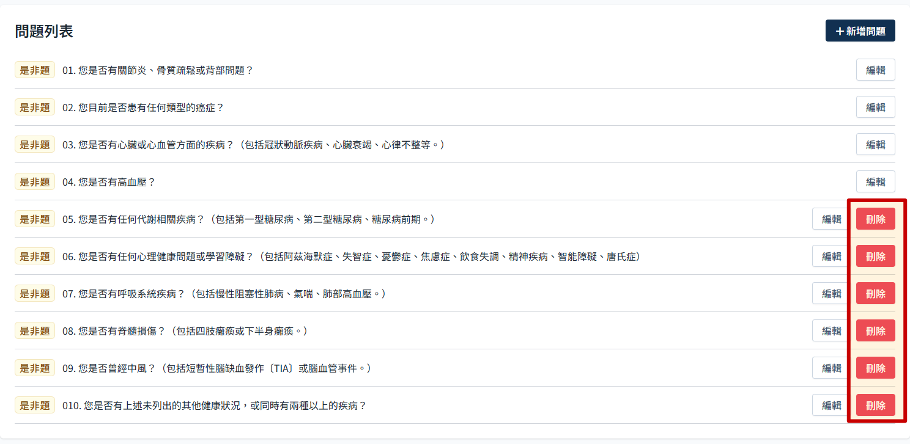

- 弹窗确认，此操作无法复原请谨慎操作
  

## 设定页面跳转条件

这里用来设定问卷的区块跳转逻辑，勾选并保存变更后才生效。
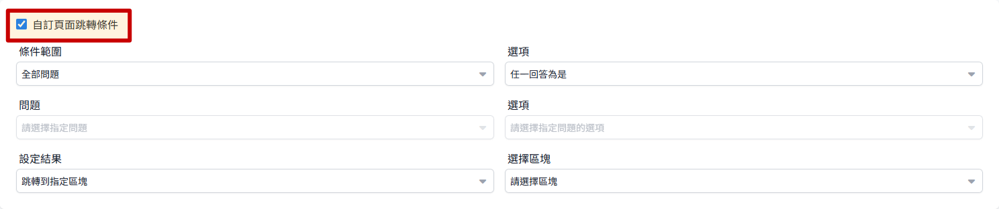

:::warning 条件范围
依照目前提供的需求，仅制作已全部问题为条件范围的判断，后续看是否有针对个别问题的需求再进一步开发。
:::
