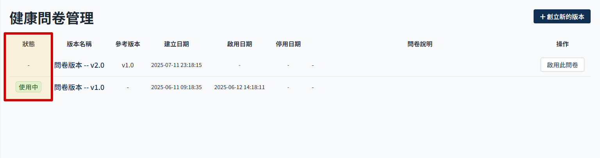

# 健康问卷状态说明

说明健康问卷分为两个部分，一个健康问卷的问题，一个是身体数据的评比结果。

> 2025.04 问卷及数据涉及使用者身体状况评估及推荐适用的运动强度，故问卷需做版本管理，一方面需要提醒使用者定期更新问卷（纪录使用者最后一次填写问卷的时间，每三个月提醒一次），若有新版本问卷也可提醒使用者重新填写。

### APP 操作条件

- 使用者在　APP 内要获得推荐课程，必须要先有问卷纪录。

## 问卷状态说明

- 无状态：可编辑，通过栏位必填验证状态会变成 待使用。
- 待使用：可编辑，可启用。
- 使用中：目前使用中的问卷版本，不可编辑。
- 已失效：保留之前纪录供比对，不可编辑，不可再度启用。
