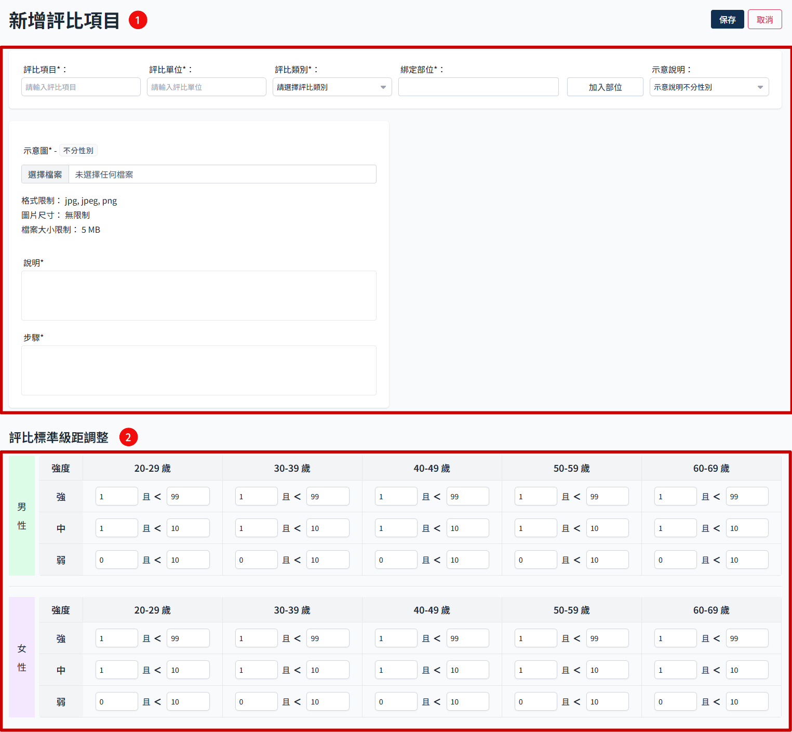
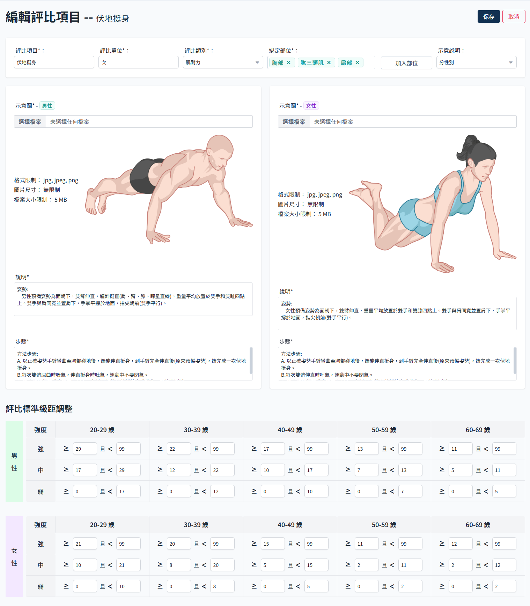
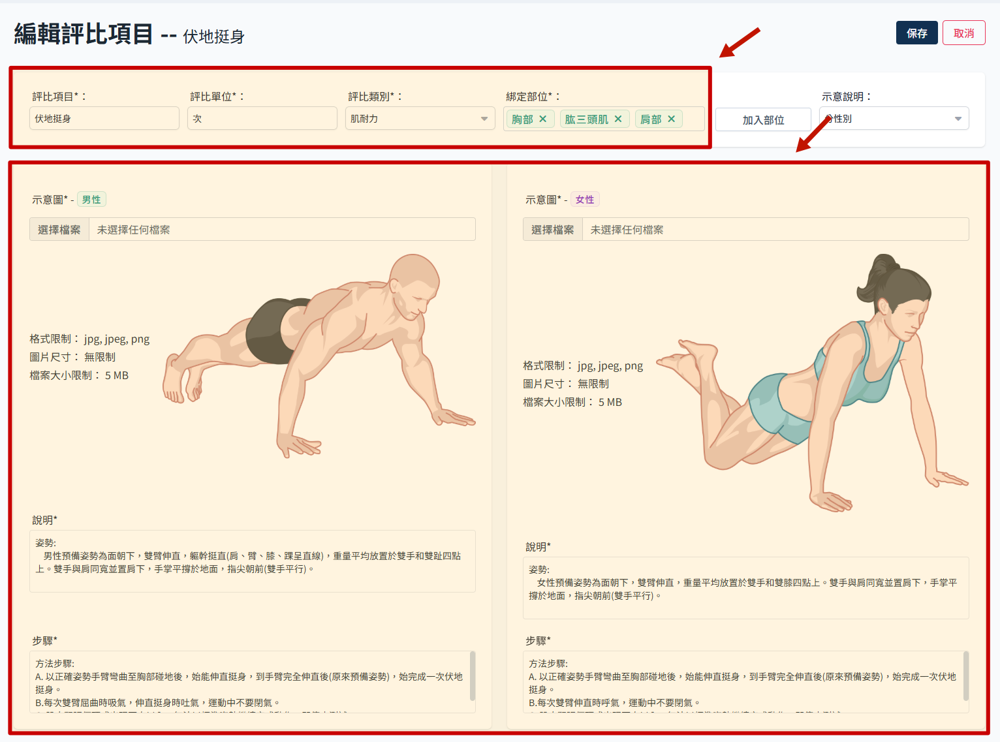
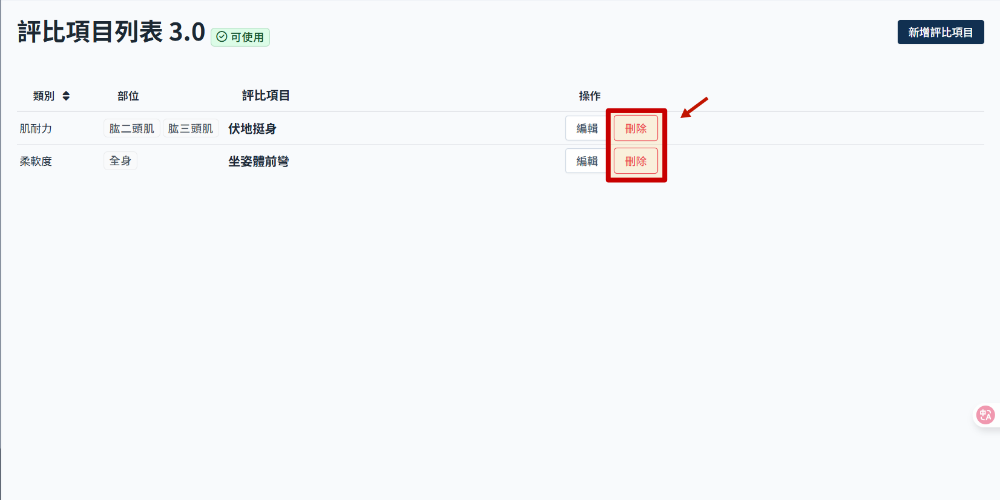

# 数据评比项目

数据评比内依照需求可建立不同类别的评比项目，每个评比项目需要建立对应的数据表格。

## 操作流程

### 新增评比项目

:::warning 必填栏位
此页面若有任何一个空缺栏位即无法送出。
:::

- 进入评比版本后，点选新增
  

- 新增评比项目页面分为2个区块
  
- 基本资料与示意图
- 对应级距设定：使用者填写的数值对应的强度，这边务必注意填写数据的正确性，如有填错会导致判断逻辑失误。

### 编辑评比项目

- 进入评比版本后，点选 编辑
  

- 可以调整页面内各项设定
  

#### 基本资料区

- 项目名称
- 评比单位
- 评比类别：预留后续扩充，同个类别下可能有不同项目。
- 绑定部位：预留后续扩充，进一步分别不同部位的情况对应不同运动强度。
- 示意图及说明：可以选择是否需要按照性别显示不同示意图。

#### 评比标准设定

使用者输入的数值对应的强度，影响最终推荐给使用者的运动强度。

:::danger
这里注意级距之间的数值，千万不可重复，送出时无法检查输入值是否符合逻辑，若这边输入重复数值，会直接导致使用者数值判断失准。
:::

### 删除评比项目

- 点击删除
  

- 再次确认即删除该评比项目，此删除无法复原，请谨慎操作。
  
