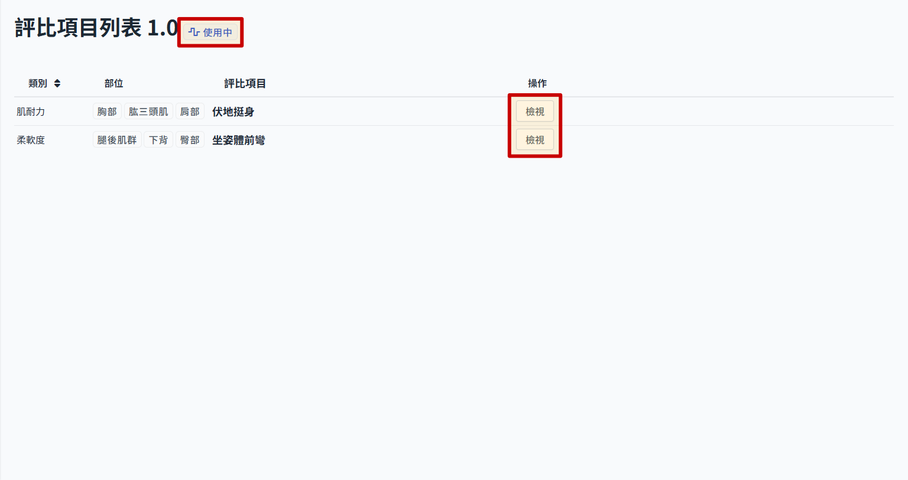
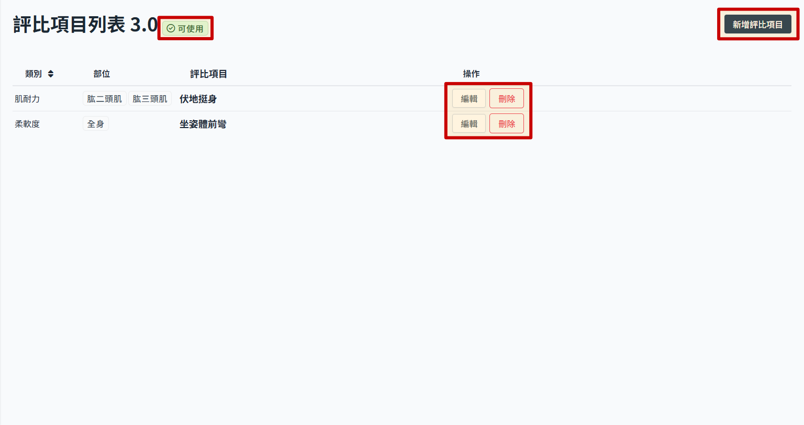

# 数据评比结果

此为健康问卷内最后一个区块，身体数据及评比内容的编辑与检视。

## 新增数据评比版本

> 带入目前最新版本内容，自动产生新的数据评比版本，状态显示为可使用。

- 进入数据评比版本列表
- 点选 创立新的版本　后，会看到下方表格内多了一个新版本，系统会以最后更新的版本资料带入产生新的版本。
  

## 编辑数据评比

> 使用中的版本不可编辑。

- 从版本列表点选版本名称，可进入看该版本内的评比项目。
  
- 状态为 使用中 的数据评比版本，进入后会看到只能检视内容，不可新增或者编辑
  

- 状态为 可使用 的数据评比版本，进入后可以看到操作按钮，此时可以新增/编辑/删除评比项目，项目操作参考 [数据评比项目](./transform-subject.md)。
  
